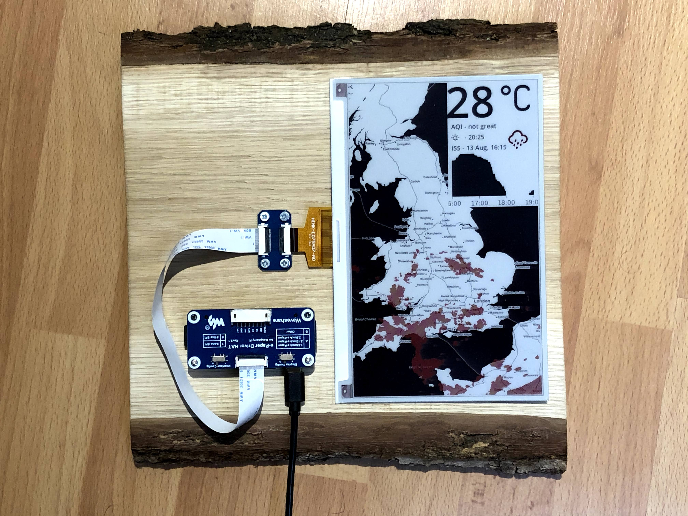
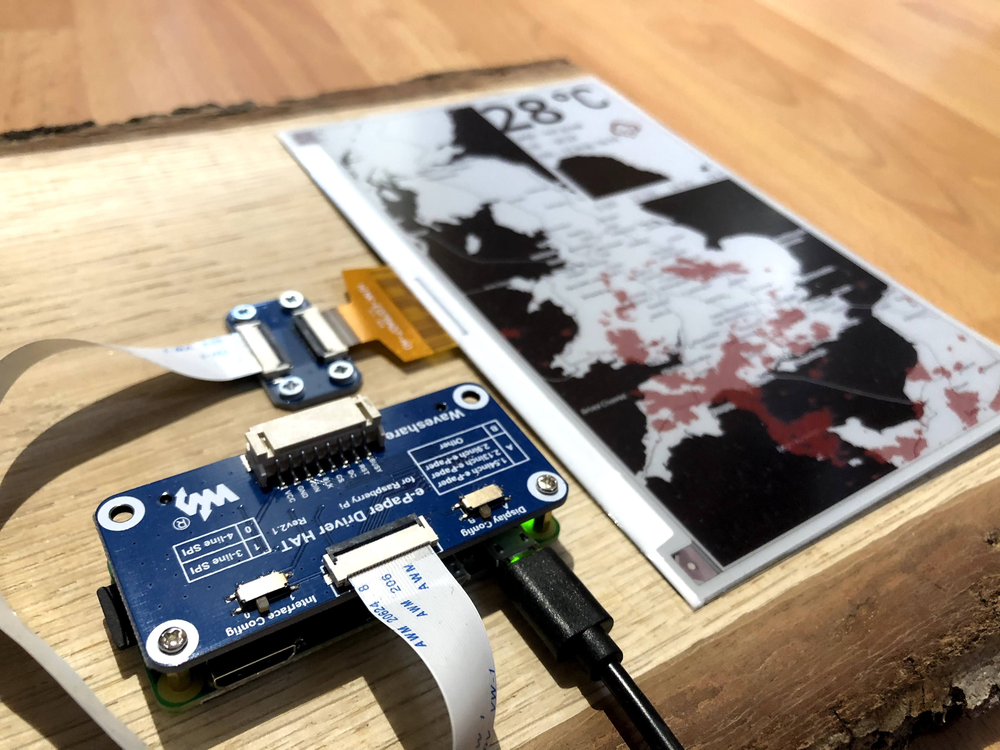

Another one of my lockdown projects...

I've always like the idea of making an always-on display.
Something like the Magic Mirror project [here](https://magicmirror.builders/), or a productivity dashboard using an LCD display [here](https://www.jlwinkler.com/2017-05-25/raspberry-pi-productivity-dashboard/), but I also wanted something that is a bit more visible in bright light and uses a little bit less electricity.

Hence, I settled on the idea of making a giant e-ink display that I could use to show whatever I wanted.
Until I saw [how expensive the panels are](https://amzn.to/3iHGepG), and I settled on a much smaller [7.5" e-ink 2 colour display](https://amzn.to/2E5lol0).

## What does it do?

Well, there's a few modes (in case I ever get bored).

Normally, I keep it in *weather* mode, whereby every 10 minutes it will update and show the following:

- Temperature
- Current weather conditions
- Rain chart for the next few hours
- Air quality
- Sunrise and Sunset times
- [The next time the ISS will pass overhead](http://www.isstracker.com/)
- Weather radar of the UK [(just because it looks cool)](https://www.metoffice.gov.uk/public/weather/observation/rainfall-radar#?map=Rainfall&zoom=5)

There's also the *cowsay* mode, whose sole purpose is to present a random dad joke every hour, in the popular [linux cli tool](https://en.wikipedia.org/wiki/Cowsay) format.

<!-- TODO: Cowsay mode picture -->

## How to build it?

It's relatively simple, really...

You only need a few components: A [Raspberry Pi Zero W](https://amzn.to/2DWrynQ), an e-ink display (I chose [this 7.5" 2 colour display from Waveshare](https://amzn.to/2E5lol0)), and *something* to mount it all one.

The instructions for putting it together are fairly self explanatory, so I'm not going to bore you.
It's just plug and play.

The software is a little bit more of a pain in the ass, Waveshare have a [GitHub repo](https://github.com/waveshare/e-Paper) with drivers for each of their displays, but no perfect method of building a UI for these displays, so the best way to push something to the display is in the form of a bitmap (essentially png) image.
The refresh rate of the display is a pathetic ~1 minute so don't worry too much about how long it takes to build that image.

I have a repository with all the code for this project on my GitHub [here](https://github.com/jamesjarvis/eink-dashboard).

It makes extensive use of various API's, including [Climacell](https://www.climacell.co/weather-api/) for the weather data, [ISS Open Notify](http://api.open-notify.org/iss-pass.json) for the ISS times, [ICanHazDadJoke](https://icanhazdadjoke.com/) for the dad joke service, and [This online cowsay generator](https://helloacm.com/api/cowsay/) because I couldn't be bothered to generate it myself, although looking back it would probably have been easier to do it manually.

For the map images, I used the [OpenStreetMap Toner](https://github.com/openmaptiles/maptiler-toner-gl-style) style tiles for the map and the [MetOffice rain radar](https://www.metoffice.gov.uk/public/weather/observation/rainfall-radar#?map=Rainfall&zoom=5) tiles for the rain overlays.
I originally used [OpenWeatherMap](https://openweathermap.org/weathermap), but whilst it was good at global coverage of rainfall, it had very low resolution.

## Next steps

I practically never do hardware projects and this has been super fun!

I'm still thinking of ideas to use it for (if you have any ideas of a cool use for this format of display, contact me!)

Ideas I've currently considered:

- [Coronavirus cases tracker](./predictions)
- Public transit departure times
- Health dashboard
- [Word clock](http://www.dougswordclocks.com/)
