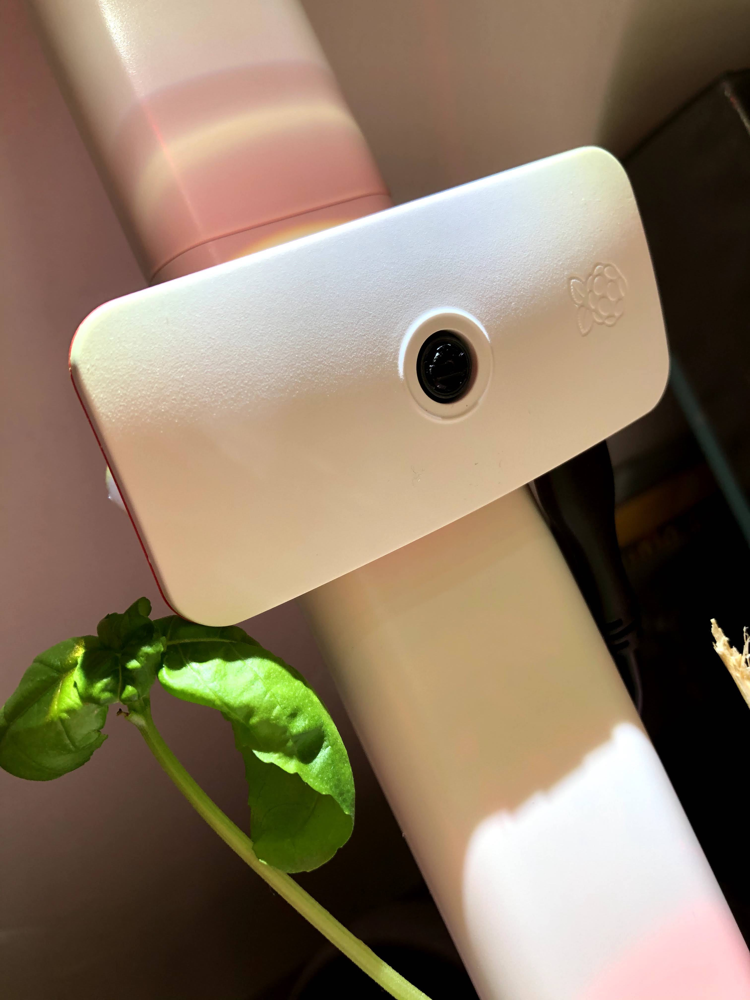
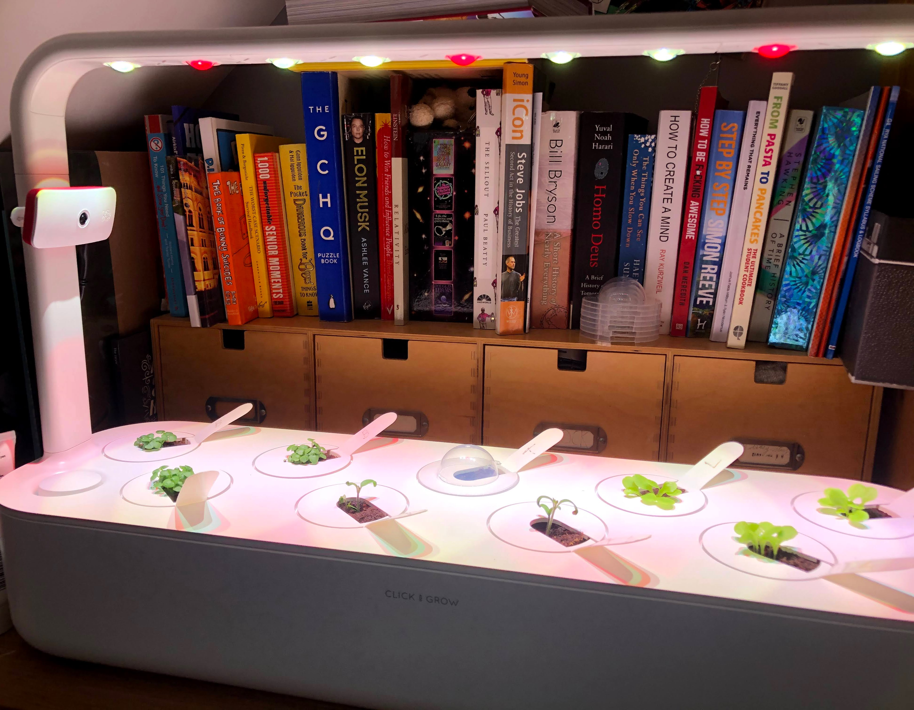
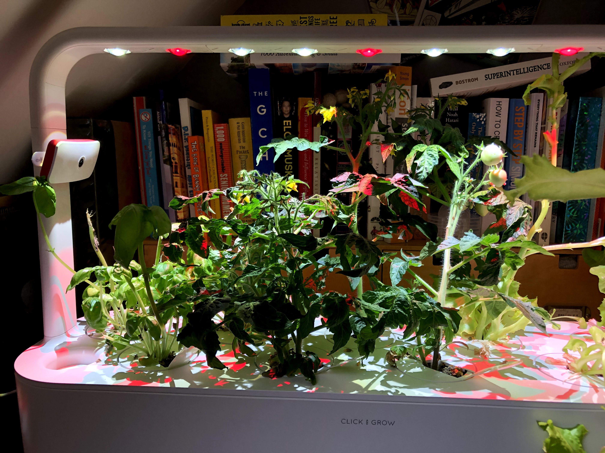

Another lockdown project!

For some reason I've been getting into gardening over the lockdown, from building an automatic irrigation system for our newly built vegetable patch to taking part (and winning) a sunflower growing competition, it's about the most interesting thing I could think of doing whilst being stuck in my house during a great spell of weather.

This year, for my birthday I recieved an [indoor vegetable garden](https://amzn.to/31Xp40r), and thought it would be fun to set up a timelapse camera to monitor the plants growing!

Since I'm currently also slightly addicted to Raspberry Pi's (now up to 4 in my collection!), I thought this would be a good use for one of them.

So, I bought the [Raspberry Pi Zero W camera combo](https://thepihut.com/products/adafruit-raspberry-pi-zero-w-camera-pack-includes-pi-zero), strapped it to the side of the garden and adjusted the focus of the camera with a pair of pliers to improve the focus a little bit.



The end result is this cute little video:

<!-- TODO: insert video -->

This little video was the result of 2 months of growing and almost 200GB of images!
I set up the camera to take a photo every 30 seconds (which in hindsight was a little bit too often, and the final video only took a frame each 16 minutes)

## Scripts

I thought I would share the little script I used to pull images from the camera, sort them into good (clear, well exposed) and bad (too dark, fuzzy, etc), and then render them into a timelapse...

Firstly, on the camera all you need is a little script that helps with actually taking the photos:

```bash
#!/bin/bash

take () {

    DATE=$(date +"%Y-%m-%d_%H_%M_%S")

    raspistill -t 100 -q 20 -o /home/pi/timelapse-images/$DATE.jpg

}

take

sleep 29

take
```

Just `chmod +x` it and add it to the cron jobs with `crontab -e` and if you want it to run every minute, then append this to the crontab:

```bash
* * * * * bash /home/pi/camera.sh
```

Now, on another computer (preferably faster and on the same network as your RPI), you can set up a little script like:

```bash
#!/bin/bash

echo "!!! Requires EXTERNAL-SSD to be plugged in at all times !!!"

echo "Retrieving latest images"

rsync -a -v --ignore-existing --remove-source-files pi@pi-cam.local:/home/pi/timelapse-images/ /Volumes/EXTERNAL-SSD/timelapse-images

echo "Filtering and linking based on shutter speed to get rid of flickers - VERY SLOW STEP"

echo "Checking and skipping a few thousand photos..."

for f in /Volumes/EXTERNAL-SSD/timelapse-images/*.jpg
do
    fname=$(basename $f)
    # If not bad and not good (ie: not sorted yet), process and filter
    if [[ ! -f /Volumes/EXTERNAL-SSD/filtered-timelapse-images/$fname && ! -f /Volumes/EXTERNAL-SSD/bad-timelapse-images/$fname ]]; then
        ss=$(exiftool -exif:shutterspeedvalue -s -s -s $f | cut -c 3-)
        sss=${ss/.*}

        # If the correct shutter speed, then place in the filtered folder, else cache in the bad folder
        if [ "$sss" -gt 30 ]; then
            echo Linking $fname
            ln -s $f /Volumes/EXTERNAL-SSD/filtered-timelapse-images/$fname
        else
            echo Caching bad photo $fname
            ln -s $f /Volumes/EXTERNAL-SSD/bad-timelapse-images/$fname
        fi
    #else
        #echo Skipping $fname
    fi
done

echo "Generating timelapse"

ffmpeg -r 1920 -pattern_type glob -i '/Volumes/EXTERNAL-SSD/filtered-timelapse-images/*.jpg' -vf "transpose=1" -vcodec libx265 -r 60 /Volumes/EXTERNAL-SSD/filtered-timelapse.mp4 -y

echo "Done!"

open /Volumes/EXTERNAL-SSD/
```

This script obviously requires an external ssd, and will require some modifications for you to use.
It also requires [ffmpeg](https://ffmpeg.org/) to be installed locally, so make sure that's all set up before any annoying errors hit you in the face.

Basically all this script does is download the latest images from the RPI, delete them from the RPI once done, then filter them into symlinked directories of "good" and "bad" photos - essentially caching them.

Then it triggers a rendering job that takes *absolutely FOREVER* to create a h.265 encoded timelapse of it all.
(Originally I used h.264 but h.265 took up honestly 1/8th of the space without losing much quality which is fantastic!)

Hope you've enjoyed!

Before:



After:


