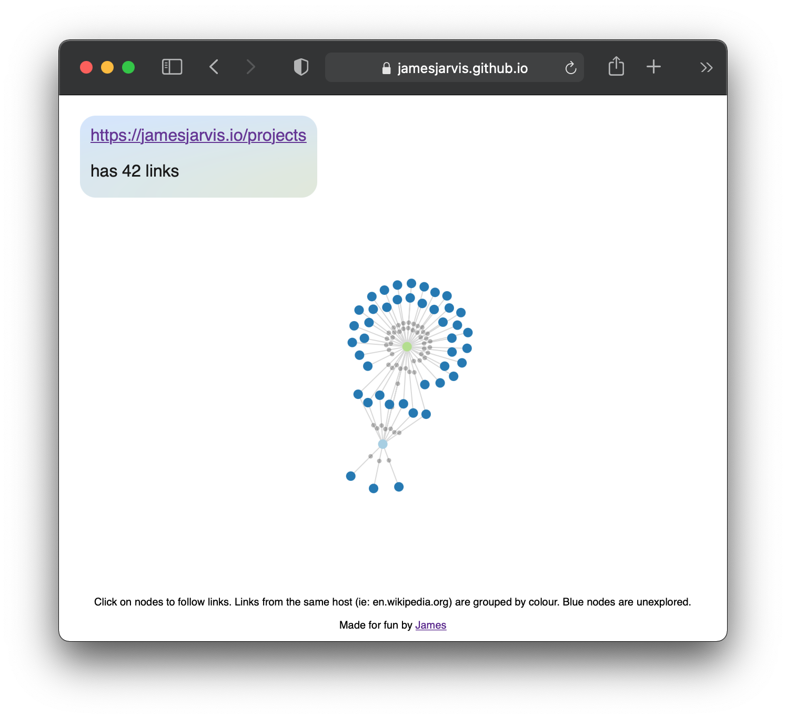
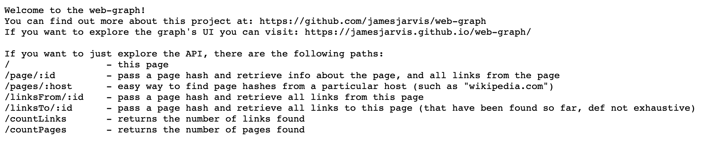
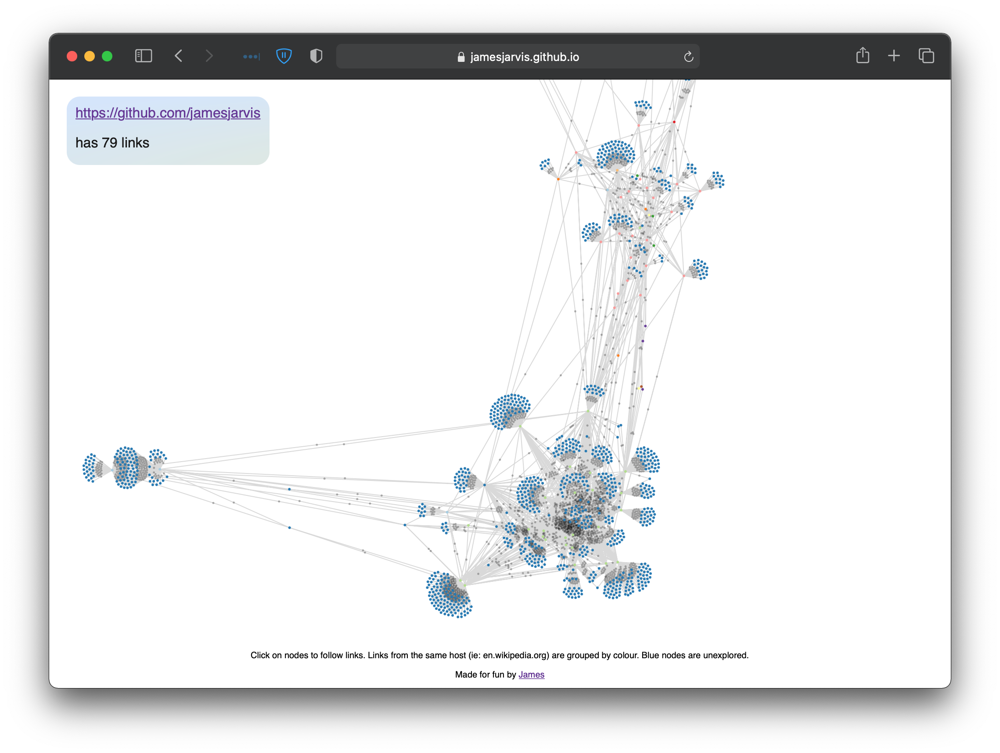

Did reading the previous instalment of "mapping the internet" [read here](../backlink-crawler/) leave you a bit... underwhelmed?

Same here.
I mean, sure I had built a little program that could follow and store links on the internet, but it couldn't be ran continuously (could not store the crawling state between runs), and there was just no easy way to traverse or visualise the graph *yawn*.

So, in this chapter I am going to go through how we have improved this service to become the beautifully graphical service that is:

<https://jamesjarvis.github.io/web-graph/>

> NOTE: By default, the graph starts from <https://jamesjarvis.io>, but if you want to change it to start from a page of your choosing (provided it has managed to scrape that part of the web already), you can give it a shot by changing the url query parameter such as: <https://jamesjarvis.github.io/web-graph/?url=https://en.wikipedia.org/wiki/London>

## Part 1: Maintaining state

So I wanted to eventually run this service on a raspberry pi 4 I currently have just sitting in my attic doing [occasional speedtests](../speedtest/).

I've also decided that I want to be able to stop and start the crawls (say, when performing an upgrade), without losing any data between runs.

In order to facilitate this, I need to have a list of URL's that have been "seen" but not "crawled" yet.

I had 3 ways I could think of doing this:

1. Spin up a message queue system, like [kafka](https://kafka.apache.org) or [rabbitMQ](https://www.rabbitmq.com) to store unprocessed URLs and yeet them out to processors for the actual crawling.
2. Add another table in the database, with the pending URLs.
3. Store this information in a simple queue file (read from the top, append to the bottom).

I tried all 3:

### RabbitMQ

First, I tried RabbitMQ, and got it working after a few hours of mucking about with it.

However, it *ate* my poor raspberry pi's RAM as soon as the queue was over a few thousand URLs, and I couldn't work out how to persist messages properly.

I also didn't really need the complexity, as I didn't want my ISP to boot me off the network for making a continuous 100 requests/s, so I wouldn't have bothered with more than one consumer anyway.

If I was building this to be an actual, scaleable service, then I'd have swallowed the extra AWS bill and continued, but this ain't it chief.

### Whack it in a DB table

Another embarassing thing about the infra for this project is that I'm running the raspberry pi with an 8 year old 1TB external hard drive I had lying around.

It's not the fastest and is in fact the biggest performance bottleneck (if I could be bothered, I would have bought an SSD but this isn't worth £80 + dealing with this limitation is interesting enough).

As a result of my cheapskate-ness, this is also out of the question, I needed something more lightweight.

### Simple file based queue system

This was the way, effectively traverse the web in a breadth-first fashion by appending any found URLs to the end of a list, and crawl any URLs by taking from the top.

Nice and easy.

## Part 2: Making the data easy to query



Eventually, I wanted to expose this information, but in an easily cacheable and web friendly way.

Enter: an API service.

You can actually check it out if you want at <https://api.jamesjarvis.io>.

It's been set up to be as easily cache-able (thanks to cloudflare) as possible, and it's open for anyone to use, provided you're aware it's hitting the shitbox in my attic and I don't want my ISP to throw me off their network.

Also, I used different queries than the first iteration of this project, in order to speed it up.
Indexes help a lot as well! Once the DB grew to >100k items queries used to take minutes, and now after some enthusiastic indexing can take <1s.

Some fun things you can do with it:

- Find all pages at a particular host (limited to 100): <https://api.jamesjarvis.io/pages/en.wikipedia.org>
- Get an overview of a particular page (just URL, host and links from, limited to 100): <https://api.jamesjarvis.io/page/e518da42a48097ceb7648a9961428e300f2db545>
- Find all links *from* a particular page (limited to 100): <https://api.jamesjarvis.io/linksFrom/e518da42a48097ceb7648a9961428e300f2db545>
- Find all links *to* a particular page (limited to 100): <https://api.jamesjarvis.io/linksTo/e518da42a48097ceb7648a9961428e300f2db545>

The last one is currently not being used by myself, though I may make an inverse graph traversal, whereby you can discover all the pages that link to a page...

I've also set up my [e-ink display](../eink-dashboard/) to monitor the number of [URL's crawled](https://api.jamesjarvis.io/countPages) and [links found](https://api.jamesjarvis.io/countLinks) for my own amusement as well.

### Self hosted??

Yup, it's slow as shit and is as reliable as my ISP (who apparently work on a *best effort* case), but thanks to some aggressive cloudflare caching, the most common endpoints should be relatively quick.

## Part 3: Graphical representation

> "What would a visual representation of browsing the internet look like?"



Check it out at <https://jamesjarvis.github.io/web-graph/> , and if you want to start from a website of your choosing, you can modify the url query param like: `https://jamesjarvis.github.io/web-graph/?url={your_page_here}`.

Because I couldn't be bothered to set up a proper react application + build process for this project, the whole thing is in one html file, and actually transpiles the required javascript from reactJS source on load time - maybe not the fastest but hey this isn't exactly a performance project + it's so easy to deploy.

You can check out the whole front-end source at <https://github.com/jamesjarvis/web-graph/blob/master/frontend/index.html>, ~200 lines is all you need for this *beauty*.

I ended up using a react wrapper around [D3.js](https://d3js.org) for the actual graphing, and it made me remember just how much I love and hate javascript.
It's a rocky relationship.

You'll also notice that running this site is very cpu intensive, and yes it is, nothing more to add really.
My personal record was `1874 nodes` and `3556 links` expanded before my browser crashed, your mileage may vary.

## Part 4: What have I learnt from this?

1. Hardware can be a real bottleneck, next time use an SSD for IO intensive operations.
2. Building services to be resilient to failure is extremely liberating.
3. JavaScript still sucks to use, package management is still hell and documentation is generally just a bit weak, considering you get zero type information from the language itself.
4. Proper database indexes are the difference between life and death.
5. Caching is still amazing.

Some of my favourite snippets of code:

### Channel based interface for reading off of a queue

Look how neat this is, as waiting to read from the queue channel / sending to the processing channel are both blocking operations, this works as fast as these two components.
We are also able to pre-fetch a number of items from the queue's file if we wanted to improve performance a bit.

This also enables an easy method of gracefully shutting down the program.

```golang
linkProcessor, err := linkprocessor.NewLinkProcessor(
	linkStorage,
	500,
	queue,
	1,
)
failOnError(err, "Could not initialise link processor")

log.Println("Begin processing...")
urlProcessingChan := linkProcessor.SpawnWorkers(2)

sigs := make(chan os.Signal, 4)
signal.Notify(sigs, syscall.SIGTERM, syscall.SIGINT, syscall.SIGHUP, syscall.SIGKILL)
ticker := time.NewTicker(10 * time.Minute)
defer ticker.Stop()
processing := true
for processing {
	select {
	case s := <-sigs:
		processing = false
		log.Printf("Received signal %s, shutting down gracefully...\n", s)
	case url := <-queue.DeQueue():
		urlProcessingChan <- url
	case <-ticker.C:
		log.Printf("%d urls in the queue", queue.Length())
	}
}

<-linkProcessor.GracefulShutdown()
log.Println("===== Shut down link processor =====")
```

### Periodic batcher from a buffered channel

This is a slightly improved version from the original post.

This turns out to be a great way to convert a message by message insert operation into a batchable operation.
It also works as a great way to rate limit database operations, as you can still fill up the channel up to the buffer size, and slowly drain it at whatever rate you choose.

```golang
func (pb *PageBatcher) Worker(endSignal <-chan bool, doneChan chan<- bool) {
	// We want it to die on the endSignal, but otherwise keep looping
	for {
		select {
		case <-endSignal:
			doneChan <- true
			return
		case <-time.After(100 * time.Millisecond):
			var pages []*Page

		Remaining:
			for i := 0; i < pb.maxBatch; i++ {
				select {
				case page := <-pb.bufChan:
					pages = append(pages, page)
				default:
					break Remaining
				}
			}

			if len(pages) == 0 {
				break
			}

			// The batch processing
			err := pb.s.BatchAddPages(pages)
			if err != nil {
				log.Printf("Batch adding pages failed!: %e", err)
			}
		}
	}
}
```
