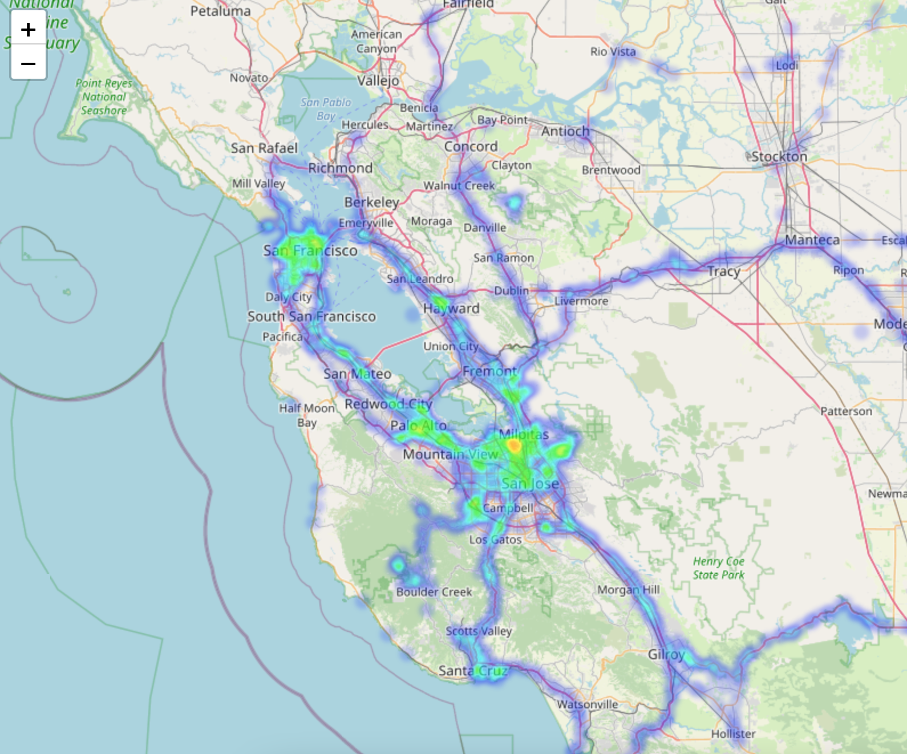

So this one is more of a revisit than a totally unique project, but this all came about thanks to a little sprinkling of *dependency hell*.

The goal of this little project was to be able to visualise my google location history (and other source of location info such as strava activities or workouts from my apple watch) on a strava style heatmap [like this one](https://www.strava.com/heatmap).

My first foray into this was little more than a fork of luka1199/geo-heatmap [link](https://github.com/luka1199/geo-heatmap) as I'm a sucker for believing that a lot of GitHub stars means a project is well maintained (silly me).

A previous fork I made tried to incorporate Poetry [link](https://python-poetry.org) for more deterministic python dependency management and execution.
Sounds good right?

## Python dependency hell

However, when trying to run this script after upgrading to macOS 11, I was getting some issues while trying to download NumPy (see more [here](https://github.com/numpy/numpy/issues/17784)).

I know this may seem like a little issue, but the goal for this project was to simply rerun this script every year or so, minimal effort so I can just update a file with my latest location history.

> NumPy doesn't work? Why the fuck not? Why do I care? What does NumPy have to do with creating a .html file?

Since this is ultimately a fairly simple project I decided to just spend a couple hours and rewrite in one of the most backwards compatible languages I know of: **Golang**.

I also wanted to reduce the dependency on random remote scripts in the resultant .html file as well, so I could open this file with no internet connectivity, in 50 years if I wanted to.

## You cannot escape dependencies

Ok so this section is a *little bit of a lie*, given enough effort I'm sure you can.

My goal of just having a simple program I can run once every year with zero code touching is kinda sorta there (I haven't given it enough time to check).
I'm hoping that Go's promise of constant backwards compatibility should help this out, and the removal of reliance on remote scripts means that as long as the one dependency I use in go doesn't go offline, then we should be chill.

> Why do you even have dependencies?

I'm lazy, ok?

Only downside going ahead is that I am completely reliant upon the following packages (and github itself) remaining publicly accessible.

```txt
github.com/tkrajina/gpxgo v1.0.1
github.com/urfave/cli/v2 v2.3.0
```

Whilst this little pain in the ass has taught me to be a little bit hesitant to blindly import random dependencies, tbh I'll probs carry on doing so, because dependencies are hell but I love getting code for free.
