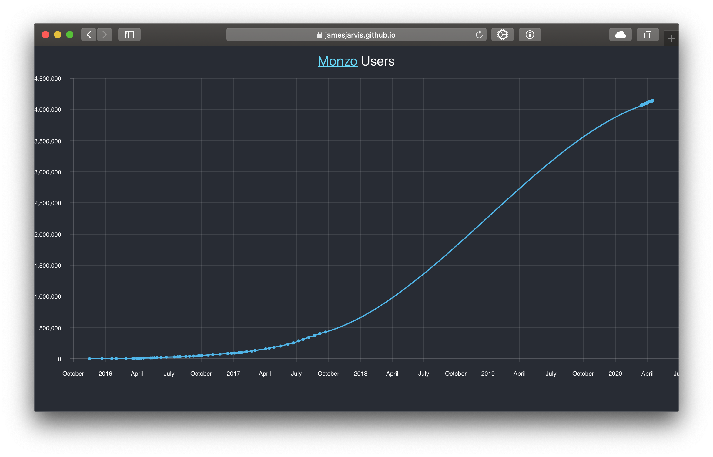

Monzo [(here)](monzo.com) is a digital "challenger" bank from the UK.

I thought it would be interesting to use GitHub to automatically update and store data regarding the growth of Monzo's current account user numbers.

Since their website includes an auto updating tally of users, I just found the api and the python scripts utilise this.

Similar to the [COVID-19 infection predictions](/projects/predictions/), this uses GitHub actions to automatically update and store data regarding the growth of Monzo's current account user numbers.
It also builds a [simple react webpage](https://jamesjarvis.github.io/monzo-users) to display the data in a graph.
Or, if you prefer you can download [the data](https://raw.githubusercontent.com/jamesjarvis/monzo-users/master/monzo_users.csv) for yourself.

Feel free to make a PR if you have some data that can fill in the gaps.

Some (better) visualisations can be found here:

- [Grafana current account growth](https://bankstats.joecarter.xyz/d/000000001/monzo-current-acc?orgId=1&refresh=5m&from=now-1y&to=now)
- [Another, grafana approach](https://grafana.tombowdit.ch/d/AWZDPrYik/monzo?orgId=2&refresh=30m&from=now-6M&to=now)
