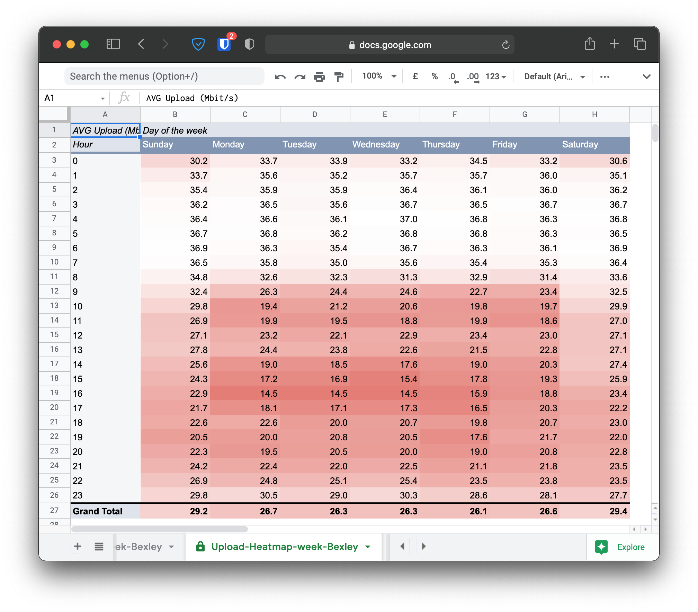

A quick monitoring project.

As anyone from the UK will know, our internet speeds aren't quite up to par with the rest of the developed world [(Don't believe me? Check it out)](https://www.speedtest.net/global-index).
From personal experience, I very rarely achieve the advertised internet speeds, even when directly connected to the router.
Similarly, some ISP's I have used seem to have loads of dropouts, and fairly poor response to criticisms of speed.
So, I though I would try to monitor the internet a bit closer, I had a spare RPI hanging around not really doing much besides a minecraft server, and thought it would be an interesting experiment.

So, I set up an [IFTTT](https://ifttt.com/) webhook, and a cronjob on the RPI to automatically update a Google Sheets document with the latest speedtest results.

Inspiration thanks to [this project](https://makezine.com/projects/send-ticket-isp-when-your-internet-drops/), and I've had a lot of fun experimenting with the data retrieved.

## Part 1: University

<iframe title="University accommodation speedtest results" width="100%" height="650" seamless frameborder="0" scrolling="no" src="https://docs.google.com/spreadsheets/d/e/2PACX-1vR3YSLPrb0yc1ojf6e7nxZ8EBW_3vrpvtDJzRqdw4ay8TEackXMFCkMy2hRk-9hVjTg0-8ZnUDPoZnF/pubchart?oid=1937794798&amp;format=interactive"></iframe>

<iframe title="University week speedtest heatmap" width="100%" height="650" src="https://docs.google.com/spreadsheets/d/e/2PACX-1vR3YSLPrb0yc1ojf6e7nxZ8EBW_3vrpvtDJzRqdw4ay8TEackXMFCkMy2hRk-9hVjTg0-8ZnUDPoZnF/pubhtml?gid=1353413610&amp;single=true&amp;widget=true&amp;headers=false"></iframe>

Whilst at university, my internet was being provided by [BT](https://www.bt.com/), and the fastest we could supposedly get was 35mb download speeds.
However, we were having constant dropouts and nothing was being done about it.

As it turns out, we have NEVER achieved our advertised internet speed, and dropped out a number of times in the few months I have run this (although as it only runs every half hour, I'm pretty sure we have dropped out more frequently than this).

Other interesting insights from this data include seeing how the [Coronavirus internet surge](https://www.bbc.co.uk/news/technology-51947447) did in fact slow down our internet as everyone moved to remote work.

## Part 2: Back Home

<iframe title="Home speedtest results" width="100%" height="650" seamless frameborder="0" scrolling="no" src="https://docs.google.com/spreadsheets/d/e/2PACX-1vR3YSLPrb0yc1ojf6e7nxZ8EBW_3vrpvtDJzRqdw4ay8TEackXMFCkMy2hRk-9hVjTg0-8ZnUDPoZnF/pubchart?oid=1087168737&amp;format=interactive"></iframe>

<iframe title="Home week speedtest heatmap" width="100%" height="650" src="https://docs.google.com/spreadsheets/d/e/2PACX-1vR3YSLPrb0yc1ojf6e7nxZ8EBW_3vrpvtDJzRqdw4ay8TEackXMFCkMy2hRk-9hVjTg0-8ZnUDPoZnF/pubhtml?gid=545090524&amp;single=true&amp;widget=true&amp;headers=false"></iframe>

As mentioned previously, thanks to [Coronavirus](https://coronavirus.data.gov.uk/), the university campus (and all associated societies, events, basically anything fun) just [abruptly stopped](https://www.kent.ac.uk/coronavirus).
So, I moved back in with the 'rents.

Our internet here is provided by [Virgin Media](https://www.virginmedia.com/), on a 350mb/s(!!) plan.
Now unfortunately thanks to the [Raspberry Pi I am using](https://www.raspberrypi.org/products/raspberry-pi-3-model-b/), the Ethernet port only supports 100 Base.
As a result, none of the speedtests will actually reach 350mb/s (but if it drops below that, then we should see a difference).

(Update - June 2020), upgraded to a [newer Raspberry Pi](https://www.raspberrypi.org/products/raspberry-pi-4-model-b/), so should be able to show faster speeds.

However, this connection actually has far more significant variance, with the most noticeable pattern contained within the upload speedtest (presumably virgin media throttles this channel to support more downloads at peak times).
Something also to note is that this environment has ~ 5x more devices on the network, which could be a bit of an issue as well.
