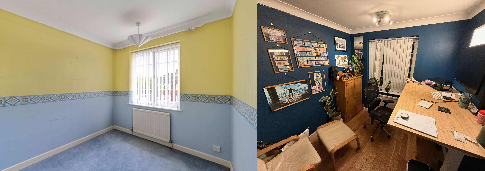
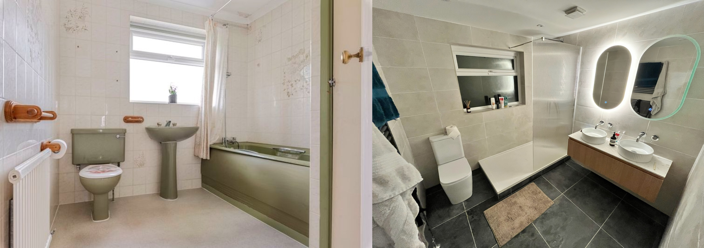
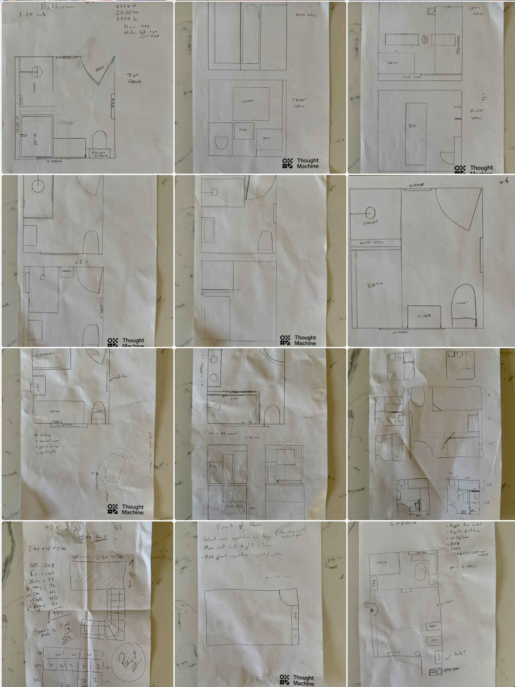
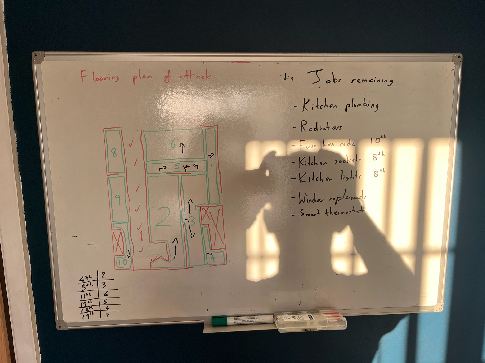
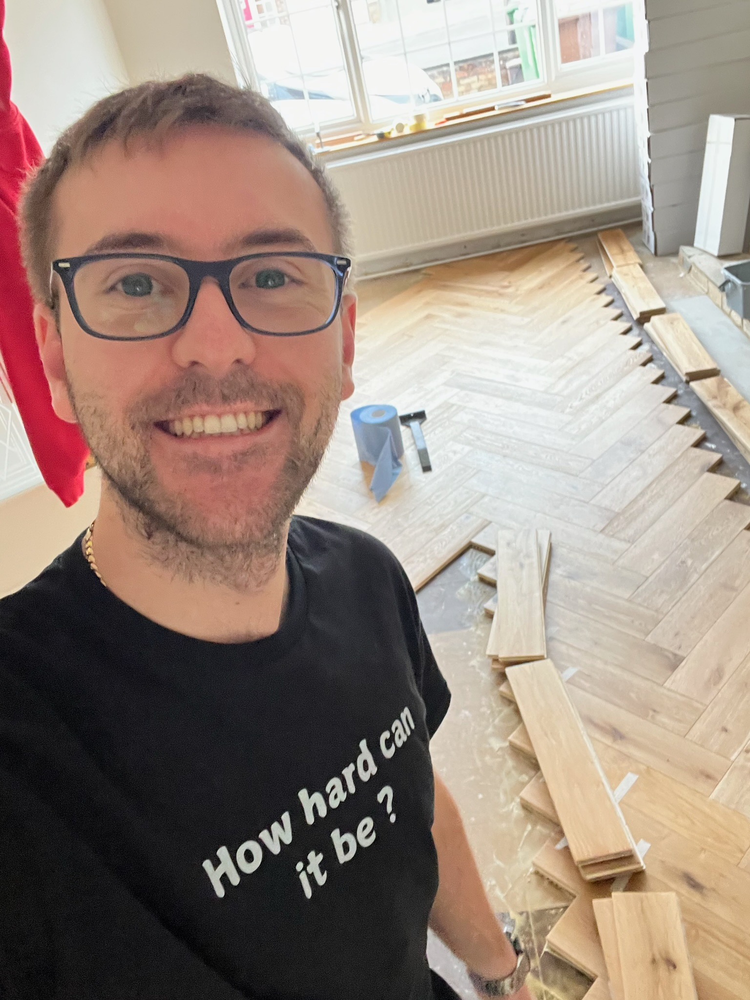

I bought my first house at the age of 26 in late October 2024, almost exactly 1 year ago.

I was up for a challenge, so even though I didn't start looking out for a complete fixer-upper, I slowly convinced myself (and my girlfriend) to take a chance on a project house.
I wrote a bit previously about how we went about searching for the right house [here](../on-buying-a-house/index.md), but TL;DR is that we could have probably lost less money by renting 😂.

So, a year ~~wiser~~ older, after hundreds of hours of work demolishing, planning, painting, plumbing, laying floors, building a kitchen, bathroom and generally fixing-up, this is my advice...

## Planning is everything

When selecting flooring, I ordered 12 samples from 4 suppliers, I spent hours planning the herringbone sequence to make sure we didn't get stuck.
The kitchen went through 5 different designs, the bathroom went through 6 different designs, and the front fireplace took hours to just measure out.

It's a bit annoying but once you've got experience with it, it's fairly painless and well worth the investment.

> Outside -> in.
> Top -> bottom.

Sage advice when working on buildings is that you should always sequence your work outside -> in, and top -> bottom.

Roof need fixing? Any leaky windows? Do those first before decorating the inside.

Want to plaster the ceiling? Better do that before you paint the walls, and definitely do that before you lay a new floor.

And any significant plumbing work should sequence neatly between outside work and any inner work, as you are definitely going to be ripping stuff apart in the process.

## You can't do it alone

I've been incredibly lucky to have taken advantage of a wonderful bunch of wilful workers from my family and friends.
None of knew what we were doing, but they've all gotten stuck in and helped out massively.

I'd like to thank Feiyang, Jason, Celia, Penny, Owen, Jon, Matthew, Brandon, Raphael, Filip and Sam for all of their help.

## Invest in tools

The first things I bought were a mitre saw and handheld combi drill. Alongside a stanley knife, some paint brushes/rollers and a borrowed handheld jigsaw I can't imagine getting this far without them. I had to do almost a thousand cuts with that saw when laying the downstairs floor, and I've been through several thousand screws with the drill.

A borrowed chainsaw was way better than the 50 year old wood saw I had for removing some trees, and the laser marker or dedicated scribing tools were far better than me eyeballing a cut.

## Double/Triple the budget

I think the last year's work (~100sqm of wood flooring, every room redecorated/furnished, all radiators replaced and a new kitchen / bathroom) cost me approximately ~£45k.
I had originally thought ~£35k would cover everything comfortably including the gardens and some more furniture - turns out I was off by about double!

Timing is also something not to be underestimated.

## How hard can it be?

> "Fuck it, let's give it a go"

This kind of attitude is the most important thing required (possibly more so than capital imho) when taking on a big project.

You have to be willing to jump into a domain you know absolutely nothing about, mess stuff up, and figure it.

## Understand what you are signing up for

This isn't for the faint-hearted, it's deliberately a massive pain in the arse and can be extremely stressful, not to mention economically exhausting.

Getting [taxed 43%](../uk-tax-burden-2025/index.md), handing over stamp duty (worse tax ever), only to remember that 20% of your new kitchen's cost is also going to HMRC is a bit of a kick in the teeth.

Working a full time job, then spending evenings and weekends on DIY whilst living without heating or running water in a dusty house, eating only microwaveable food gets old real quick - you do need to be slightly stupid to do this.

## Now the itch is scratched, I'm itching to do it again

...and I'm not talking about loft insulation!

It has been a genuine pain in the ass sometimes, but I can't help but have a huge sense of accomplishment sitting in my home built home office.

I'm not looking to repeat some of the stress of the last year (I almost lost my eyesight twice due to stress!) but I am looking forward to taking on more big projects like this in the future.

Hopefully now, with a little more experience behind me!

