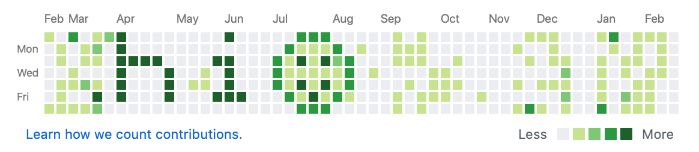

My roommate Tim [(his LinkedIn)](https://www.linkedin.com/in/timothylee0/) and I decided to start challenging ourselves with little applications we could develop.

The first thing we thought of was a way to decorate your GitHub activity board, example below:

The idea being that you could just draw or type (or both) anything that you wanted to on a canvas that represented your github activity board, and with one simple script you could create the required commits and upload that new repo to your GitHub.

This is thanks to a feature/flaw in git that allows you to create commits (even empty commits) with any date attached.
Therefore, all we need to do to generate a cute little activity graph is to simply work out the date ranges required, how many commits to make each day, and to generate a script that allows the user to do this.

We used React for the front end, and wrote simple JavaScript functions to generate the bash script which is available for you to download and run.

[Check out the website](https://jamesjarvis.github.io/git-art/), or if you'd prefer, [jump straight to the code](https://github.com/jamesjarvis/git-art)

Made open source under the [WTFPL licence](http://www.wtfpl.net).
