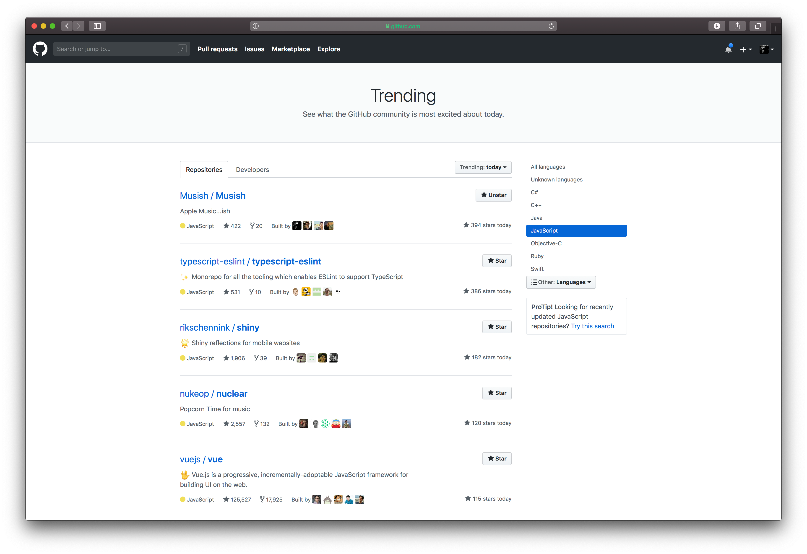
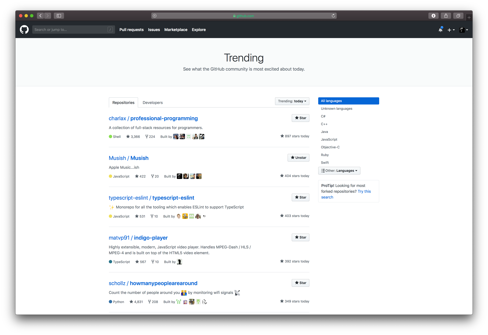

On December 1st 2018, a group of friends and I attended the MLH Local Hack Day in San Francisco.

Made by myself [(me)](https://jamesjarvis.io), Brychan [(link)](https://brychan.io), Raphael [(link)](https://raphaelvigee.com), and Filip [(link)](https://www.linkedin.com/in/filip-grebowski-b24810116/).

This particular hackathon was sponsored by GitHub and Microsoft, and had a theme of creating the best open source project for the community. We came first in San Francisco for our project.

We decided to make an [Apple Music web player](https://musi.sh), since pretty much every single other music streaming platform already had one. Some people aren't sure why Apple Music would need a web player, since surely you could just use iTunes for that?

Well, as was [hilariously summarised in a comment on Macrumors](https://forums.macrumors.com/threads/apple-music-gets-another-unofficial-web-player-with-launch-of-musish.2166187/#post-27018681), iTunes isn't exactly lightweight.

Musi.sh (Musish) is an [open source project](https://github.com/musish/musish) now, using the A-GPL license, and as of February 2019, has over [1400 stars](https://github.com/Musish/Musish/stargazers), and [9 contributors](https://github.com/Musish/Musish/graphs/contributors).

We released it (sent out a few emails) while walking around Central Park, NY on the 18th January 2019. We weren't really prepared with what was to come, and have since had quite a few articles written about it.

## Analytics and Feedback

According to Google Analytics, we have had over 50,000 unique users on Musi.sh from over 110 different countries, and we have found some very positive articles written about it at least 13 different languages found so far.

Some notable mentions:

- [Business Insider Tech 100 2019 #97](https://www.businessinsider.com/uk-tech-100-2019-most-important-interesting-and-impactful-people-uk-tech-2019-9?r=US&IR=T#97-the-undergraduate-students-who-beat-apple-to-building-a-web-player-for-apple-music-4)
- [University of Kent homepage](https://web.archive.org/web/20200322103909/https://www.kent.ac.uk/)
- [University of Kent profile](https://web.archive.org/web/20200322104018/https://www.kent.ac.uk/courses/profiles/undergraduate/computer-science-year-industry-musish)
- [9to5Mac](https://9to5mac.com/2019/01/18/apple-music-web/)
- [9to5Mac again](https://9to5mac.com/2019/01/21/apple-music-mac-app/)
- [Gizmodo](https://gizmodo.com/how-to-play-apple-music-from-the-web-1831977569)
- [Macrumors](https://www.macrumors.com/2019/01/21/apple-music-web-player-musish/)
- [Cult of Mac](https://www.cultofmac.com/601520/musish-apple-music-web-portal/)
- [The Next Web](https://thenextweb.com/apps/2019/01/22/use-apple-music-in-your-browser-with-this-pretty-web-interface/)
- [01Net (France)](https://www.01net.com/actualites/musi-sh-le-service-qui-donne-acces-a-apple-music-depuis-un-navigateur-web-1617352.html#xtor=AL-123461)
- [My Apple (Poland)](https://myapple.pl/posts/18640-kolejny-web-player-apple-music-musish-stawia-na-podobienstwo-do-pierwowzoru)
- [Twitter](https://twitter.com/search?q=Musi.sh)

Also, we made it to #1 and #2 on GitHub trending for all JavaScript projects and all languages respectively on the 19th January 2019, which was our favourite achievement of all!

