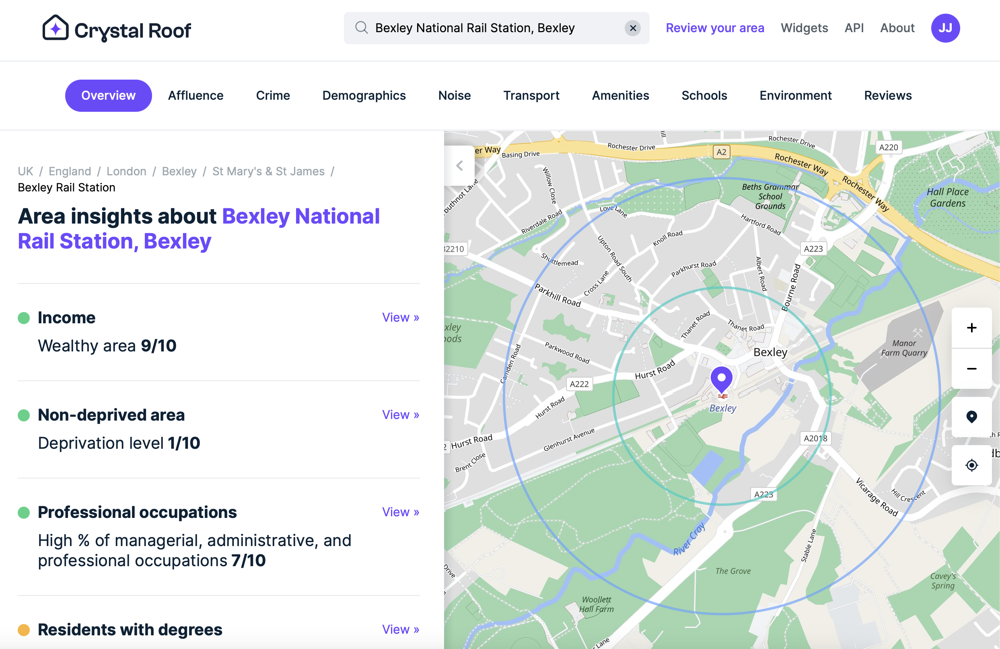

I have a bit of a confession to make.

I am horribly, frustratingly, embarrassingly... _indecisive_.

- It took me 4 months to decide on a new bike earlier this year, when I desperately needed one to commute.
- It took me 3 months the year before that to decide on a new coat for the winter, when I had no waterproofs at all.
- It took me over a month to decide on a replacement car when mine was crashed in to, and I was out of my most useful mode of transport.

But these were comparatively _small_ purchases.
What if I were to continue acting the same, but apply this to the **largest financial decision of my entire life**?

So, we arrive at March 2024.
The beginning of my search.

## Why buy?

For context, I have been living primarily in East London (Wapping/Limehouse) for the last 4 years, in flats of varying quality.

The rent was roughly ~2kGBP/month, split between myself and my housemates - not all too bad considering I could cycle into work/around London, and that is something I thoroughly enjoyed doing.

But there was always the sense of impermanence to the rental situation.
Like my housemates, I had never decorated my room, too afraid to knock anything into the walls, or risk losing our deposit.
I "made do" with furniture/appliances/colours/bathrooms I didn't like, because I couldn't get rid of the existing stuff, and I wasn't allowed to change something that wasn't mine.

Cynically, I was starting to assume that landlords fill flats with the cheapest ikea furniture, not because it was cheap for them, but because it would eventually break, and clawing back deposits was another stream of income for them.

Honestly, I was exhausted of not feeling safe enough to make my place of residence, my home.

Settled: I'll buy my own place! (After years of aggressively saving for a deposit).

## What buy?

It all depends on your lifestyle and your budget really, and there is no good guide for this.
But I would recommend you take stock of what you do / what you plan to do during a normal week now and in 5 years, and optimise for that.

You basically have a choice of:

|               | High Budget            | Low Budget              |
| ------------- | ---------------------- | ----------------------- |
| Very sociable | House/Flat inside city | Flat inside city        |
| Less sociable | House outside city     | House/Flat outside city |

Whatever you buy though, watch out for the following:

- Transportation links
- Floor plan (in flats this is pretty much fixed forever)
- Service charge and ground rent charges, also check for a sinking fund
- If it's a flat, does it have an EWS1 certificate?
- Avoid leasehold as much as possible

My personal preferences leant me towards having full ownership of control over wherever I was am living, so flats were out of the question.
Terraced, semi, or detached are where I'm looking for, I want some physical ground I can build a shed on, or park a car.

## Where buy?

I'll preface this by saying: I _love_ London.

I'm also _from_ London, the South East.

Now, the South East of London has without a doubt got the **worst transport options** out of all of London.

The city planners somehow forgot about the South when building out the underground network, and the government was quite happy with selling the national rail network to private companies, with no incentive for improvement.

However, my family all live in South East London, and it's _almost_ affordable, so that's that.

One day, I'll move to some nice leafy suburb in the North West, but that goal is not achievable just yet...

## Useful Resources for Finding a Property

These are some fantastic resources I used to determine my ideal area, and to track down a house on the market:

- [CrystalRoof](https://crystalroof.co.uk/report/postcode/DA51AA/overview)
  - Offers insight into local crime reports, demographics, transport links, and amenities. Really helpful if you aren't sure about an area!
- [HoodMaps](https://hoodmaps.com/london-neighborhood-map)
  - Hilarious and vaguely useful community map for rating a location.
- [Zoopla Travel Time](https://www.zoopla.co.uk/travel-time/)
  - If you don't know where to start, but know you want to be able to commute to work by bike in less than 30 mins, this is a great tool.
- [Zoopla](https://www.zoopla.co.uk/for-sale/map/property/kent/bexley/bexley-high-street/da5-1aa/?q=DA51AA&search_source=home)
  - Probably the best home finding app.
- [RightMove](https://www.rightmove.co.uk/property-for-sale/map.html?includeSSTC=false&keywords=&sortType=2&viewType=MAP&channel=BUY&index=0&radius=0.25&locationIdentifier=POSTCODE%5E215471)
  - The most popular home finding app.
- [OnTheMarket](https://www.onthemarket.com/for-sale/property/da5-1aa/?view=map-list)
  - Also useful home finding app, covers some extra estate agents.
- [Jitty](https://jitty.com)
  - Honourable mention, has some interesting AI search features, like "period property with tall ceilings and a driveway".

## How buy?

I had been living in rental accommodation for the last few years, with some "free" months [in Singapore](), or staying with my parents.
I'm quite frugal in general, aside from the odd splurge on [flight tickets](), so as a result I have managed to save approximately 30% of my income (around the same that goes to the taxman, grrr) over my first 6 years of work.

By around March 2024, this looked like a good enough amount for a bank to take me seriously as I requested a mortgage offer, and so I started to look for places.

If you have followed the writings of [Gary Stevenson](https://www.wealtheconomics.org), the evidence of rising inequality can provide an explanation of why housing is becoming more unaffordable, but since I'm in no position to change this, it's worth jumping in to the housing market as soon as you can.

The process is fairly simple:

1. **Get a Mortgage in Principle (MIP).**
   This is generally a crude affordability check for how much you can theoretically borrow from a mortgage lender.
   This is a maximum value, do not take it as a goal.
   Remember, you want to own a house, not to be owned by a bank.
2. **Go for some viewings.**
   Different areas, different styles, different sizes.
   This will take a long while (4+ months) but that's ok.
   You probably won't know what to look for but the most common, most valuable questions are:
   - How old is the boiler?
   - How old is the kitchen?
   - How many plug sockets does the property have?
   - Does the property have good insulation?
   - Does the property have damp? Or any leaks?
   - In what condition is the bathroom?
   - Are there any signs of Asbestos?
   - How are the neighbours?
3. **Put in an offer.**
   I would even recommend being a bit cheeky, and putting in an offer ~10% below market value for a property you won't mind losing.
   You'll get more of an idea of how the process works, and it won't feel so daunting after the first time.
   Remember, you aren't just buying a property, you are selling yourself as a _good buyer_, that can be extremely valuable to some people.
   If you are a first time buyer, you are worth _at least_ 1% of the property value more when compared to another buyer in a long chain.
4. **Get a good solicitor**
   It's not worth being cheap here.
   These guys are expensive, but the difference can be night and day.
   Go for one with good recommendations, though probably not one from the estate agents, as they normally get a kickback.
5. **Get a mortgage**
   Talk to mortgage brokers and go hunting online.
   Neither one covers the whole market, so try both for the best deal.
   I used these resources that I would highly recommend:
   - [www.mortgageadvicehub.com](https://www.mortgageadvicehub.com)
   - [www.moneysavingexpert.com](https://www.moneysavingexpert.com/mortgages/best-buys/)
     I would recommend getting a mortgage on the longest term possible (~40 years), as you will always have the ability to overpay and pay it off early, without being forced into it.
6. **Get your surveys done**
   You've got the offer accepted, a solicitor, and a mortgage offer in place.
   You now need have a professional come round to inspect the property and make sure everything is up to scratch.
   Your lender may offer a discount here if you use one of their partners, I recommend you take it, as surveys without a discount can be >£500.
   Your solicitor will also request environmental surveys (the surrounding area), to make sure you aren't about to buy a future swamp.
   Technically your solicitor is acting on both your behalf, and on the behalf of the mortgage lender, it is in both of your interests that the house does not fall apart or get swallowed up.
7. **Negotiate with the sellers**
   Right before completion, you will want to negotiate with the sellers for any furniture or fittings left behind, as well as try to claw back some money for any surprises the survey may have picked up.
   If the house has a really cool but cumbersome cooker/pizza oven, or turns out you found the roof needs repairing, this is the point at which you want to perform a second round of negotiations.
8. **Wait...**
   This step is frustratingly inevitable. Any time you need to communicate with lawyers, or the Council, you lose both the will to live and a good chunk of your time.
   Expect the total purchase process to take ~2-6 months.
9. **Complete!**
   Completion day is one of those strange days in your life you'll remember for just being a bit odd.
   It is the day when your solicitor gets given £100k's from the bank, basically all of your savings, and you get the keys to your new place, all at once.
   If you are in a chain, this day gets even more complicated, but let's pretend life is easy for a second and ignore that.

## What next?

Grab a paintbrush, a tapemeasure, and your worst clothes.
Chances are that if you found a place within your budget, as I did, you have a lot of refurbishment / renovation to do.

Even if it doesn't _need_ renovation, I'd recommend leaving your mark at least.

As of writing this post, I'm in this stage.
All I can say for now is, make sure you budget for it!

Good luck!
