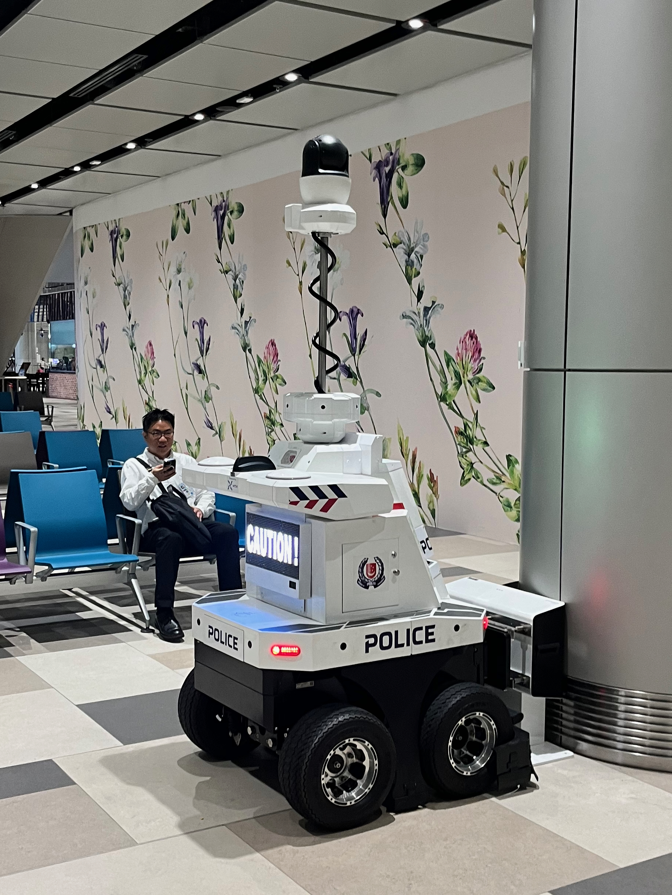

This is a 4 part series of posts:

- [Setting up for a Mini-Sabbatical]()
- [Reflections on 3 months living and working in Singapore]() (you are here!)
- [Mini-Sabbatical Part 1: China]()

## Preconception


"Disneyland With the Death Penalty"
William Gibson - [Wired, 1993](https://www.wired.com/1993/04/gibson-2/)


An often quoted metaphor, that draws responses from both crowds.
"I like Disneyland, whats not to like about that?", "That's kinda dystopian".

The country has progressed quite a bit in the 30 years since that was written, but it still echoes throughout general sentiment.

## Arrival

I landed in Singapore on Monday, 1st August.
I was supposed to originally fly out a week prior, but delayed it due to having already booked tickets with my Dad to see our first ever Formula E (it’s a strange sport, we were sat inside! The races don't last particularly long, but give it a few more years and I could see it taking on Formula 1!)

Heathrow was… Heathrow-ish?
I checked in a bit early and had a few hours to kill, which I duly spent eating a microwaved fish and chips in the overcrowded Wetherspoons at Terminal 5.
Anyway, premium economy was nice - I never realised you could have metal cutlery and wine on a plane!

For those who haven’t yet experienced it, let me tell you, Singapore Changi airport is in a league of its own!
It’s a masterpiece of architecture and dignified travel, and almost unimaginable to the average european flier.

Not that I got to see much of it, as my work-booked taxi driver whisked me away immediately on arrival, a mere 20 or so minutes after landing the plane!
I almost fail to appreciate this comfortable efficiency, that will come to become thematic of my overall experience of this new country.
I ask my driver how he finds Singapore.
He says he loved his 30 years in residence, besides some feedback for the weather, and recommends a few touristy activities for me to try out once I settle in.
We cross the nation in 25 minutes.

My base for the next 90 days is Raffles place, the original British landing site and previous colonial centre point of South East Asia.
I find it fitting for my first foray into this part of the world.

After checking in and generally gawking at my new hotel, I enthusiastically change into a pair of shorts, text a co-worker-friend and head out for a few drinks to meet the rest of the crew I’ll be working with.

## The Weather

I had been warned “you’ll be sweating after 5 minutes outside, and frozen after 5 minutes inside”, so I had packed a mix of shorts, trousers and hoodies.
As it turns out, I was quite comfortable with both, as long as I didn’t move too much outside, or sit too still inside.

, but rarely seen")

On my second weekend I attempted the [MacRitchie Reservoir](https://beta.nparks.gov.sg/visit/parks/central-catchment-nature-reserve/activities/hiking-nature-walk) hike - a 10km hike around one of the few naturally forested areas left in the centre of the island.
I highly recommend giving this a go if you visit, as you’ll be tripping over cicadas, frogs, monkeys, turtles, strangling figs and a whole host of other interesting flora and fauna.
However, do go with a lot of water, sun cream, bug spray and very breathable clothing!
My first naïve hike was performed in a cotton shirt and shorts and, by the end of it, I might as well had swam through the reservoir instead.

A quick trip to Uniqlo fixed that, and I was lightly draped with breathable, practically disposable clothes for the remainder of my time there.
If you are coming from a Northern European country, I’d probably recommend bringing 2 days worth of clothes with you, and just buy whatever you need once you arrive.

A few weeks into my stay, I thought I’d try and take up running again.
I figured the consistent 7am-7pm sunlight hours worked well with my optimistic morning jog + dip-in-the-pool-to-cool-off routine.
The challenge (besides my pathetic fitness level) is to run as far as you can before the sun really starts to shine and you become too dehydrated to walk straight.
Realistically I only did this just under 20 times, but I loved it, and made some noticeable health improvements whilst out there.

## The government

I'm a sucker for a good museum.
I also love a well planned urban environment.

As a consequence, it turns out I _really_ loved the [Singapore City Gallery](https://www.ura.gov.sg/Corporate/Singapore-City-Gallery)!
I spent **hours** reading every little plaque about various iterative designs for how to use the reclaimed land on the south side of the island.
Where waste goes, how they ensure energy and water security, to how they plan for the fittingly named [Urban Heat Island Effect](https://education.nationalgeographic.org/resource/urban-heat-island/), I am just continuously in awe at it all.

I've always liked the idea of re-attempting a stint at Architecture (I originally went to visit my old university for an architecture open-day, before giving up and enrolling in computer science for the good old fashioned employment prospects).
So for anyone interested in a similar thing - I recommend this museum.

Check out [The food and activities](#the-food-and-activities) for more recommendations.

Also - NO CRIME!
The European mind can hardly comprehend this, but you can genuinely accidentally leave your laptop in a cafe, and have full confidence it will still be there by the time you come back, hours later.
There is no vandalism, and consequently there are actual public amenities available.

The point here is, you don't get this kind of stuff without a good amount of support from the people running the country.

Whilst "From third world to first" is still on my reading TODO list, I left with much more confidence in the competence of the government than I've ever got from living in the UK or the US.

## The people

A bit of a weird topic to reflect on, but I've found that any time I move somewhere for a while, I notice _something different_ about the people I am surrounded by.
So I thought it's worth spending a bit of time reflecting on that.

Of course, Singapore is more of an international transitory city than a closed-off city.
A solid half of everyone I met was an immigrant, but they never seemed to feel "out of place" (aside from the construction/cleaning workers, who all appeared to be shuttled in to the country on the back of open roof vans every day).
You can notice a great variety in the locals between Little India and Chinatown, but on the whole they seem to follow a few patterns:

- They are typically quite wealthy (I never met ay of "the help", but I heard many people talking about how they hire "help")
- They are very kind
- They respect their community, and in general have a deep appreciation of their Country
- They are very social, also amongst "co-workers"
  - This was an interesting realisation, but I found myself hanging out with co-workers on the weekend quite quickly in Singapore, whereas that is less of a cultural norm in London (or perhaps that's just a reflection on me!)

Honourable mention of course also goes out to my parents and my friends who came over to stay or travel with me for a few weeks.

## The work

Ah yes, that thing... the reason I was sent to Singapore...

I'll be honest, the work was more difficult than I originally imagined.
I was sent over with a vague mission of "improve < insert general description of company problem here >", and seemingly the only resource available to me was my own time.
To make matters worse, the Singapore office of my company is less than one-fifth the size of the London headquarters, and is primarily a sales/marketing outpost, with only a handful of full time Engineers.
In summary, it is a satellite office with no engineering leadership.

As a result, I emphatically struggled to progress most of my initiatives I tried to introduce, which was a strange new frontier for me to encounter.
In London, I can generally have confidence in relying on a support network of peers all around the org chart to progress or bounce ideas off of for a new initiative, and people are welcoming to trying new ideas.
In Singapore, we required "consensus" and "approval from management" (read: London's approval) to do anything.
This is strange to me, as this was even in domains wholly owned by the team out in Singapore.

Furthermore, there was much less of a culture of challenging decisions.
I'm quite happy to have my ideas challenged, as long as the approach is logical, and in return I'm quite happy with raising my objections to an idea if I think it is logically flawed.
However, in the team I was placed in Singapore, this just was not happening.
I'm yet to fully rationalise why that is.

The other side to the work was working on-call.
This has it's ups and downs, but in general was just a bit of a drain on energy.

Overall, I liked the general vibes of working out in Singapore, but if I come again I would try and work for a company who:

- Is focused on engineering/development in Singapore
- Is either headquartered in Singapore, or has strong leadership presence.

## The food and activities

This point is almost too obvious to mention, but I LOVED the variety and quality of food, and the general atmosphere.

I was staying by the Marina Bay, and a common "first day" activity when someone would visit was:

1. Take the MRT to Gardens by the Bay
2. Go to the Cloud Forest
3. Watch the "super tree" light show
4. Walk through the Marina Bay Sands hotel and shopping centre
5. Watch the Marina Bay light and fountain show
6. Either go left, and check out whatever festival is being ran in the car park
7. Or go right, and watch some free outdoor concert
8. Walk around the F1 track
9. Either go past the Fullerton, towards Lau Pa Sat. Or past Raffles, towards any one of the other hawker markets for some dinner.

I did this so many times, and never tired of it!

I won't go into too much detail, but if you're even remotely interested in architecture, museums, hikes, or eating and drinking, I'd highly recommend:

- [Singapore City Gallery](https://www.ura.gov.sg/Corporate/Singapore-City-Gallery)
  - Obviously, I already mentioned this earlier.
- [Cloud Forest / Flower Dome](https://www.gardensbythebay.com.sg/en/things-to-do/attractions/cloud-forest.html)
  - Worlds tallest indoor waterfall. This was my very first stop, and I ended up going back here 3 more times just for the sheer beauty of it.
- [Lau Pa Sat](https://www.laupasat.sg)
  - I must have visited almost every stall here during my stay. I'm also a big fan of the big fans.
- [Garden Rhapsody](https://www.gardensbythebay.com.sg/en/things-to-do/calendar-of-events/garden-rhapsody.html)
  - A **free light show**, **every day**! Such a nice atmosphere, you lay on the warm ground and look up at the lights.
- [The Jewel Changi](https://www.jewelchangiairport.com/en/attractions/forest-valley.html)
  - The waterfall is the big attraction, but just look at all those Orchids! The butterfly park and the walking net are the cherry on top.
- [Marina Bay Sands](https://www.marinabaysands.com/attractions/sands-skypark.html)
  - The building synonymous with Singapore goes without saying, but did you know you can also go for morning yoga for only 5 SGD more?
- [Henderson Waves / Cable Car](https://www.mountfaberleisure.com)
  - One is a bridge, one is a cable car. Neither are museums, but both are very pretty!
- [The Supreme Court](https://www.judiciary.gov.sg/discover-the-courts)
  - I don't think you can visit - but it looks like a UFO landed on a building...
- [Atlas Bar](https://atlasbar.sg)
  - BEAutiful art-deco style bar. Just don't try and enter in shorts and Birkenstocks like I did. They don't like it.
- [Raffles Hotel](https://www.raffles.com/singapore/)
  - It sits on 1 Beach Road and is absolutely iconic of colonial Singapore. Just remember to go to the **writers bar** and not the **long bar**.
- [Chijmes](https://chijmes.com.sg)
  - Strange one, it's a food court around an old church. Similar ish to [Mercato Mayfair](https://mercatometropolitano.com/mercato-mayfair/) in London.
- [1-Arden](https://www.1-arden.sg)
  - I stayed in this building, and would occasionally go to the top of the 51st floor to admire the field of boats stretching out into the distance, or to just watch the Marina light shows whilst enjoying a drink.
- The list could go on, but I'm getting nostalgic now.

In short, I'd be happy to go back!

