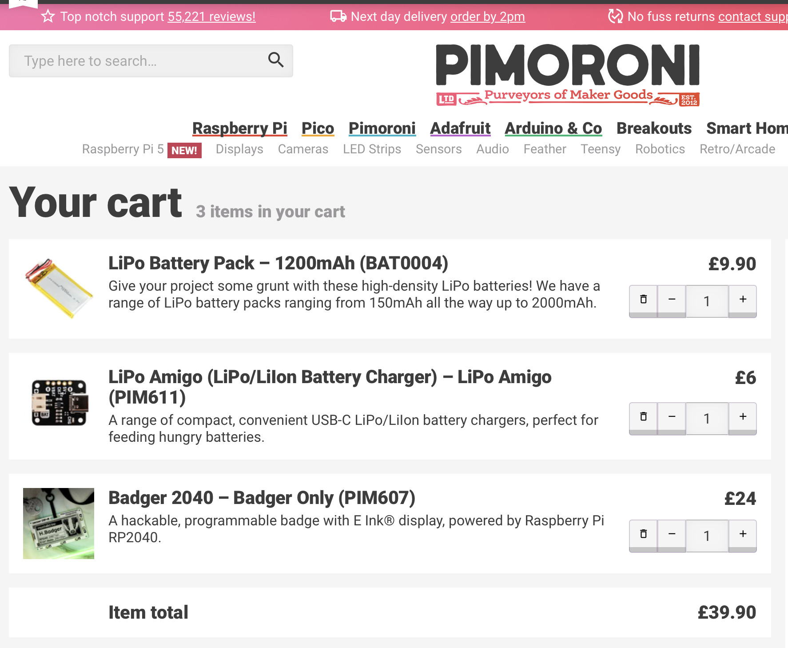
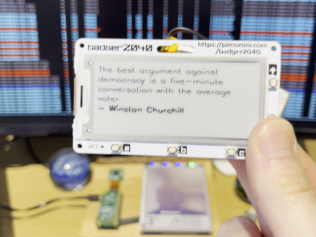

This is the story of how I built (and how you can build) a cute little display that shows you a new famous quote every day.

## The idea

Way back in December 2022, my family decided that this christmas we would DIY each other some presents.

For a few years prior we had been experimenting with a secret santa to alleviate some of the pains of having everyone each buy 10 gifts to give to each person, but when we realised most people's "wants" aren't within a £50 budget, we gave the "make something and give that" idea a go.

My ~~unlucky victim~~ adoring cousin was to be the recipient of whatever thing I could make, and since she was at the time completing her doctorate, enjoyed reading, and had recently started programming, I thought I would try and make something that combined all of those ridiculously nerdy attributes into one:

> Thou shalt build a display to show a new quote every day

I'm sure the baby Jesus would've preferred one of these over some frankincense and myrrh any day.

I had come back home for christmas and thought I could start work on making a V2 of my original e-ink display ([read more about that one here]()), so this particular type of display was on my mind, and it fit perfectly with the goal of having a dumb little trinket sitting on a desk for months at a time without having to charge the battery.

## The parts list



You could 100% do this project for about half the price if you source components on AliExpress / some other site.

However, I only had 1 week left to finish this project by the time I finally stopped procrastinating, I have always had a positive experience with Pimoroni and their shipping is normally only a couple days.

Besides, I wouldn't have to pull my hair out working out how to build a driver for this display, since the Badger2040 project is pretty well documented, and has a lot of support on [their GitHub](https://github.com/pimoroni/badger2040).

The full parts list is:

- 1x Pimoroni Badger 2040 ([link](https://shop.pimoroni.com/products/badger-2040?variant=39752959852627))
- 1x LiPo battery pack 1200mAh ([link](https://shop.pimoroni.com/products/lipo-battery-pack?variant=20429082183))
- 1x LiPo Amigo ([link](https://shop.pimoroni.com/products/lipo-amigo?variant=39779302506579))


You can choose to instead power the badger via a AAA battery pack, but I'm not a fan of disposable batteries.

P.S. Pimoroni if you want to sponsor me I have my eyes on a few other things from your site! 😉

## The quotes list

For this project I had about ~1.5MB of memory to play with on the Badger2040, so I couldn't have too much data sitting around.
Though I did want enough to cover the goal of 1 quote a day, for as long as it takes to forget the other quotes, so around 2,040 quotes should do, assuming 200 characters per quote this'll fit in under 0.5MB.

Finding the quotes was quite hard, as most sites only host useless stuff like "Top 50 inspirational quotes".

Goodreads had probably the best corpus of material over on [https://www.goodreads.com/quotes](https://www.goodreads.com/quotes), and if I were doing this again I would just write a quick script that scraped that page and trim by length of quote so it still fit on the small display.

There's even a whole GitHub project for this: [github.com/maxhumber/quote](https://github.com/maxhumber/quote), and nowadays a quick bit of ChatGPT / using your brain *audible groan* could get you this data within a few moments.

However, back in my last minute frantic I used a now-defunct API to scrape this data quickly. You can see my efforts at [github.com/jamesjarvis/secret-santa](https://github.com/jamesjarvis/secret-santa/blob/master/scraper/scraper.py) but don't bother running it as the API seemed to have gone offline sometime in the last few years.

## Displaying quotes on the Badger2040

Pimoroni offer a really good repository for writing software for the Badger2040.

They have an embedded-systems subset of Python with very low resource consumption called "micropython", that allows you to run pretty reasonable scripts on the RP2040 chip.

Combining that with an alright badger2040 library to interact with the buttons and display, and it's a good solid base point to write simple apps for the Badger2040 product.

You can view the full source at [github.com/jamesjarvis/badger2040](https://github.com/jamesjarvis/badger2040/blob/main/badger_os/examples/quotes.py) but the gist of it is the `display_random_quote` function, where we seek to a random line in a "quotes" file, and write it to the display, wrapping around the screen.

```python
def display_random_quote():
    display.set_pen(15)
    display.set_thickness(FONT_THICKNESS)
    display.clear()
    # Open the quotes file.
    quotes = open(text_file, "r")

    n = random.randint(0, TOTAL_QUOTES)
    for i in range(n):
        quotes.readline()

    current_quote_json = json.loads(quotes.readline())
    # Read a full line and split it into words.
    words = current_quote_json["content"].split(" ")

    lines = []
    latest_line = ""
    for word in words:
        latest_line_length = display.measure_text(latest_line + word, TEXT_SIZE)
        if latest_line_length >= TEXT_WIDTH:
            lines.append(latest_line)
            latest_line = ""
        latest_line += word
        latest_line += " "

    lines.append(latest_line)

    lines.append("- " + current_quote_json["author"])

    row = 0
    for line in lines:
        y = int(row * text_spacing) + int(text_spacing // 2) + TEXT_PADDING
        display.set_pen(0)
        if row + 1 == len(lines):
            # last line is the author, make a bit bolder.
            display.set_thickness(FONT_THICKNESS+1)
        display.text(line, TEXT_PADDING, y, TEXT_WIDTH, TEXT_SIZE)
        row += 1
    display.update()
```

If I were to ever productionise this, I would look to find a more efficient way to scan through the file to a random line, as that'll probably save a bit of energy.

### Uploading code to the Badger2040

Normally when you get this kind of project it's all dependent on some random toolchain you haven't installed on your machine, and it's so out of date that you'll spend your first day just debugging how to program the damn thing.

With Pimoroni's Badger2040 repo (forked to [github.com/jamesjarvis/badger2040](https://github.com/jamesjarvis/badger2040)) you can exploit the repo's Github actions to build the necessary compiled target for you!

The development flow was:

1. Clone badger2040 repo
2. Make small changes (adding a [quotes.py](https://github.com/jamesjarvis/badger2040/blob/main/badger_os/examples/quotes.py) example App)
3. Push commit to github and wait for the Action to build
4. Download the `badger2040-micropython-with-badger-os.uf2` file from the Action artifact list
5. Connect badger2040 to computer in boot mode (hold down `boot/usr` and press `rst` button as it is plugged in)
6. Copy over the downloaded `.uf2` file from step 4 to the badger
7. Bobs your Uncle

## The outcome



The outcome is quite nice if I say so myself.

It lasts a few weeks on a single charge, and when you press an up or down button it'll display a new random quote.
A simple but effective desk ornament.

I never took a photo of the original I gave to my cousin, and I'm fairly sure it was "lost" quickly after christmas, so I made myself another one :smile:
