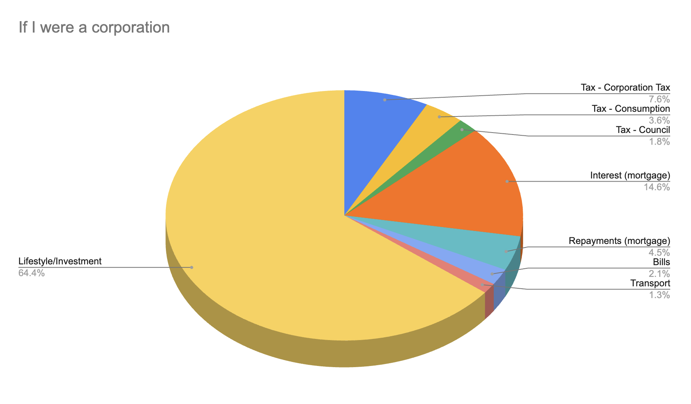

## The Reality of UK Taxation in 2025 💰

It's a strange hobby to have - budgeting - but it's something I quite enjoy framing as an optimisation problem.

Recently there's been quite a bit of chat about the burden of taxation in the UK, with several fiscal "black holes" being discovered by the government, attempting to be closed via higher taxation, and then somehow doubling in size the next year.

This is not going to be a specific opinion piece on taxation, but I wanted to provide some insight into what a typical PAYE employee as a Software Engineer in London may expect to pay in taxes in the UK.

## My Personal Tax Breakdown

Let me start by being completely transparent about my tax situation in 2025.
I'm not going to share exact figures, but I will share the percentages and structure that make up my total tax burden.

For the purposes of this breakdown, I am sampling an average month of the year, and counting "income" as any money that I am given by my employer in exchange for my labour.
I'm not including an outlier month (like paying Stamp Duty or a Capital Gains tax )

This particular month is representative of the last year I've been living in my house, where I've reduced my "lifestyle" spend quite a lot, and have been dumping money into my recent house purchase.
You'll recognise there's no "buffer/savings" section at the moment, 🤞 in a couple months I can swap the "renovation" section with "savings", and I'll probably post an update in a couple years, but the taxation breakdown will likely remain the same.

### Income

- Full time Employment, fairly standard
  - Including employer's pension contributions

### Expenses

- Tax **(43%)**
  - National Insurance (12%)
    - Note: This includes Employers National Insurance, because ultimately I pay for this.
  - Income (25%)
  - Consumption/VAT (4%)
  - Council (2%)
- Savings/Investments **(21%)**
  - Pension
- Housing **(20%)**
  - Mortgage Interest (15%)
  - Mortgage Capital Repayments (5%)
- Lifestyle **(13%)**
  - Eating Out/Groceries
  - House Renovation
  - This section has been _tight_ for a while now, and will increase after House Renovation (~10%) has finished.
- Bills **(2%)**
  - Gas/Electricity/Phone/Wifi
- Transport **(1%)**
  - TfL

### The Tax Reality

The taxes I've included in this are:

- National Insurance Contributions
- Employers National Insurance Contribution
- Income Tax
- Council Tax
- VAT
- Insurance Premium Tax
- Capital Gains Tax (currently negligible from my amounts)

I haven't included:

- Import tariffs
- Road Tax
- Any other erroneous tax on specific items that I didn't want to calculate

Total Tax Burden as an individual: **~43%**
Total Cost of Living: **~67%**

I'm not going to get too political, but if you assume my situation is fairly standard, and you assume that an economy is just the sum of its population, then it looks an awful lot like the UK economy is 43% government, about 30% housing, and around 3% _the stuff you actually see and do_.

## What if I were a business?

There are some tax benefits that for _some reason_ are only available to corporations, so I thought - what if I was a corporation?

Disclaimer: I'm not an accountant, and this is a bit of a stretched example relying mainly on the fact that expenses can be tax deductible, and completely ignoring the impact of import taxes, sales taxes, employment taxes, private health insurance etc that would be incurred.

But the general idea of it is, if an expense is vital for a company, it should be deducted from the tax liability of that company.
Whereas if an expense is vital for a person, it cannot be tax deductible.

Interestingly, you could arguably question whether an employee's income tax should ultimately just fall as a consumption tax on human capital for a corporation (i.e. Employers NI), but as the incentive should be to have companies employing people, I think this is hard to justify.

Tax burdens as a corporation: **~13%**
Total Cost of Existence: **~36%**

## Looking Forward

At the time of writing, the UK is preparing itself for a further round of tax increases in the UK (as opposed to cutting spending, reforming blockers to economic growth, or accruing further debt).

Nobody knows quite what the expected tax increases will be, but they are generally expected to tip into the "too much" category, risking some civil unrest.

Most people in the UK have absolutely no idea how much tax they are spending, or the inequality of taxation for an individual compared to a corporation - especially not to the extend that an individual with a certain level of wealth can engineers themselves into being taxed as a corporation, hence avoiding a 43% tax burden and decreasing their proportional cost of existence.

I am personally hoping for (though not expecting):

- Simplification of the tax system + reducing regulatory barriers to growth
  - See: [UK Foundations Whitepaper](https://ukfoundations.co/) outlines several blockers.
- Better public understanding of the true cost of government
  - Even better, a reduction in wasteful or too-generous public spending
- Policies that address wealth inequality and social mobility
  - See: [Fairer Share](https://fairershare.org.uk/) as one potential tax change targeting "council tax" reform.

But my concern is that we'll see more of the same: hidden tax increases, blissful ignorance of state inefficiencies, corporate tax cuts, and a growing burden on the average worker.

---

_What's your experience with taxation? Is it fairer/worse in your country? I'd love to hear your thoughts on the current system and what changes you'd like to see. Better yet, message your MP._
