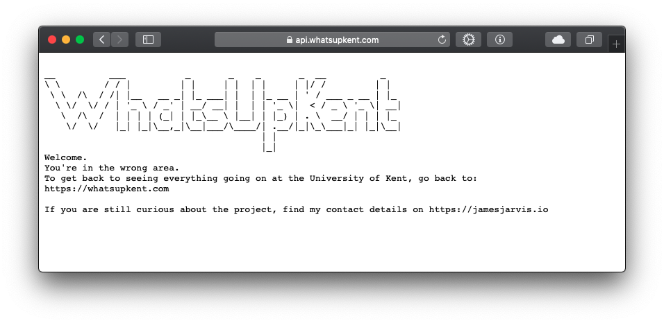
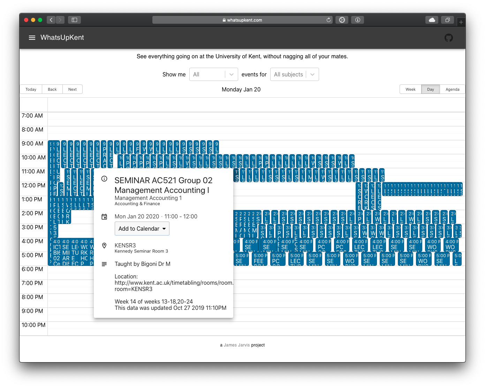
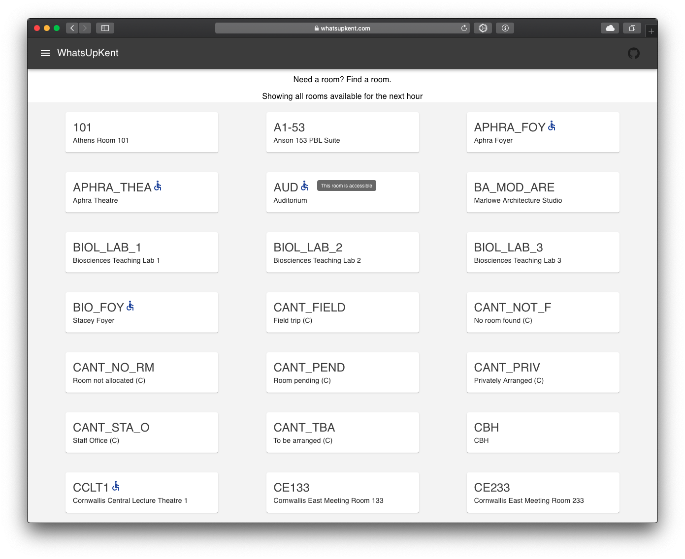
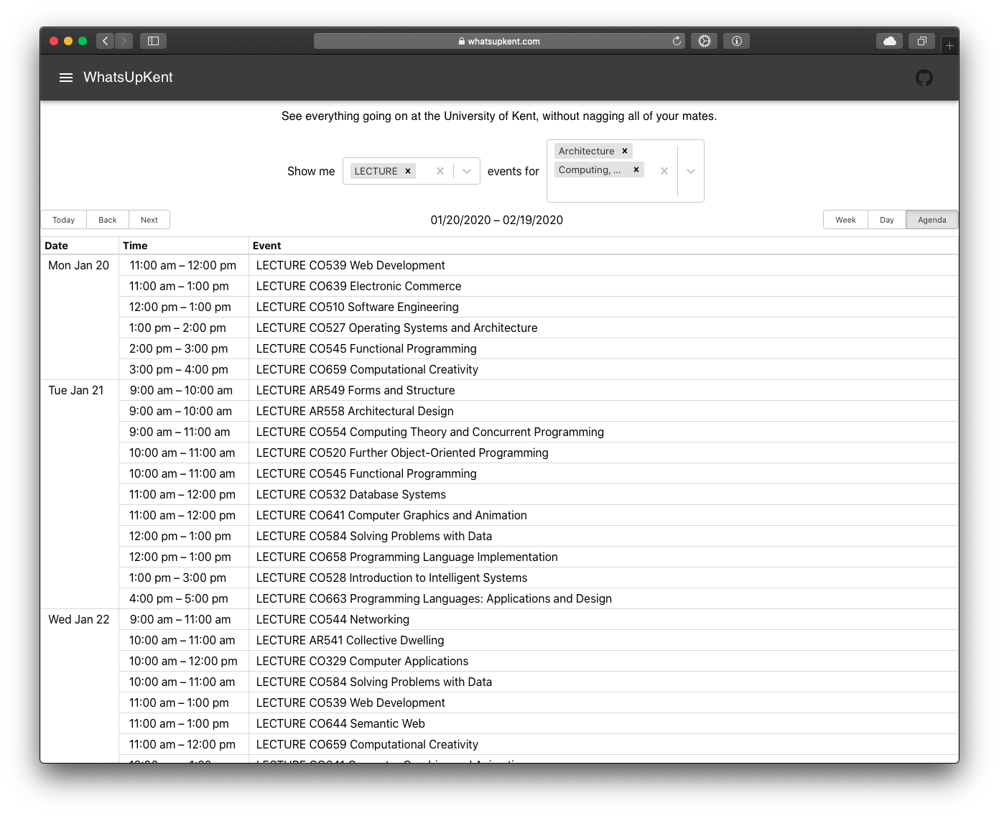
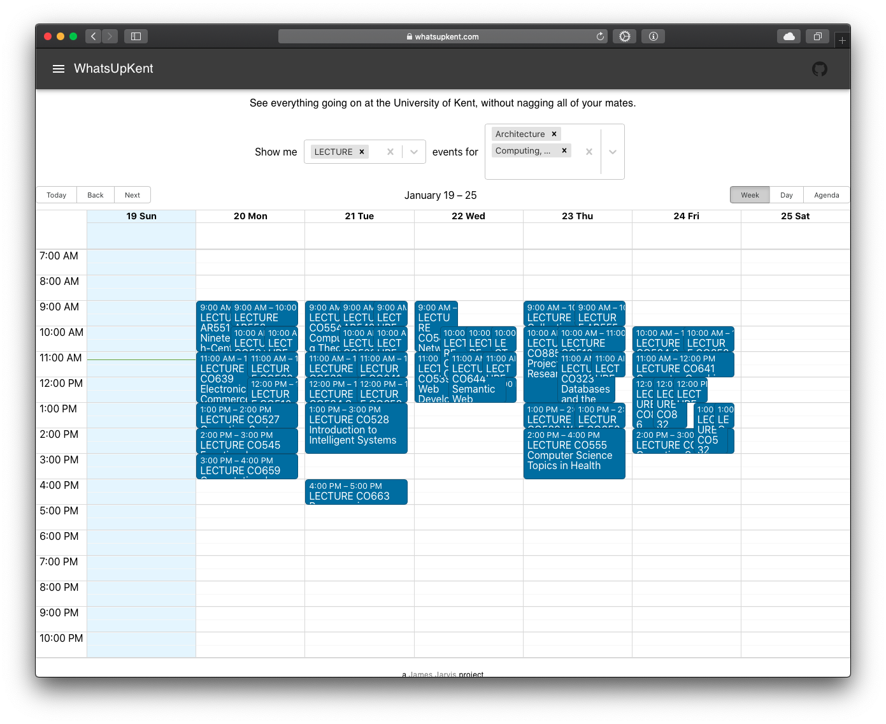

In October 2019, I was looking for a challenge.

University [(look mum, I'm on the front page!)](https://web.archive.org/web/20200322103909/https://www.kent.ac.uk/) was going ok, but I didn't feel stimulated enough, and wanted to see what else there was on offer.
Turns out paying £9k per year to learn from 20 year old textbooks isn't exactly riveting, so I was looking to see what other interesting lectures I could discover on campus.
Also, my friends and I liked to use disused seminar rooms to work in since the library was often overcrowded and I wanted an easy way to discover which seminar rooms were not being used.

I also wanted to stretch my legs and learn a bit of Golang, Kubernetes, Typescript and Graph databases.

So, I decided to create a service that would gather all student's timetables and present the information in an easy to use dashboard, to offer students the opportunity to explore other courses in their spare time.

Thanks to the university (accidentally?) publishing student timetables as publically accessible ical links, it proves fairly simple to just brute force and scrape all ical timetables from their website.
Of course, having to iterate through 50,000 timetables can be quite time consuming, so I chose [Golang](https://golang.org/) to write the server, thanks to it's remarkably easy multithreading syntax.

Since the data being retrieved was fundamentally relational, I chose to store it in a [graph database called DGraph](https://dgraph.io/).
This allowed me to achieve not only some quick queries on the data, I was also able to just easily expose a read only graphql endpoint directly to the database. Simple! :)

At this point, we are now looking at a few different services for the api: the scraper, a caching service (just to speed up repetetive large queries), and the dgraph database instance (which itself requires 2 pods).
So, for deployment I chose to look towards Kubernetes.
I bought the cheapests little VPS I could, and whacked on a [k3s lightweight kubernetes](https://k3s.io/) instance and set that up in the CI/CD (ran with GitHub actions).
As always, the [frontend](https://github.com/jamesjarvis/WhatsUpKent-UI) was hosted with GitHub pages.

Overall, the project was a success.
It managed to scrape (and continuously check for updates and re-scrape) thousands of lectures and seminars on campus, from all students, and all courses.
It was hosted at [whatsupkent.com](https://whatsupkent.com), with the backend code hosted in [GitHub](https://github.com/jamesjarvis/WhatsUpKent).
Unfortunately, I decided to close down the service before the uni got mad at me (also, I couldn't be bothered to pay the £5 a month hosting fees), but relaunching it would be as easy as pie if demand ever increases for a service like this.

## A few screenshots

The API:

Event info:

Room finder:

Agenda view:

Filtered week:
