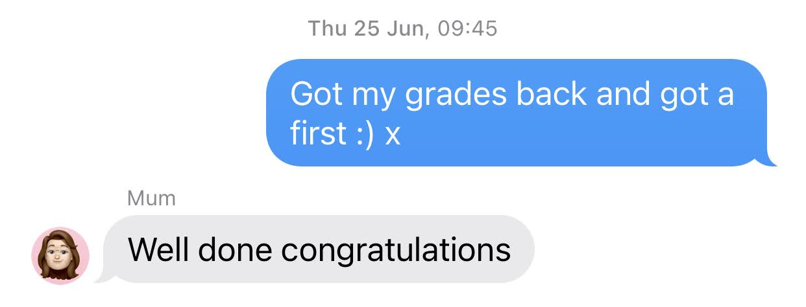

So yeah, that text message above is the only celebration of completing university that I have...

My sister graduated a year before me, and photos of her throwing her cap in the air are scattered around my family's mantlepieces.
Yet, all I have is a text?

Now, I'm being a little unfair - obviously this is not just a problem for me, millions of students around the world are having to deal with a slightly dampened celebration to end their *very* expensive education.
Furthermore, the university has said that they will try and hold a ceremony in November at the Cathedral (however, November is also a likely bet for a winter wave of coronavirus).

But, here I am.

## Grades

This is a simple one.
The United Kingdom follows a [three tier classification system](https://en.wikipedia.org/wiki/British_undergraduate_degree_classification), and you can read more about it if you really want to compare UK vs {insert country here} grades.

For me, I now have a First Class Honours Bachelors of Science degree in Computer Science (Artificial Intelligence) with a year in industry.

As is typical with [most things I do](../speedtest), I logged these grades (including per module and per assignment, but that's too boring to share) into a spreadsheet.

I made the spreadsheet back in year 1, when I realised the path of least resistance of uni was to just work harder in the early years, to give yourself some headroom later on to get worse grades (or to just take a holiday and not work as hard as you should - like I tended to do).
This turned out to be a good idea, as even though I ended up with `80.3%` overall, you can see the trendline moving downwards!

<iframe title="University grades" width="785" height="461" seamless frameborder="0" scrolling="no" src="https://docs.google.com/spreadsheets/d/e/2PACX-1vQJoij4NY302PZpMmS2EB6Im7FD2LE2SB84i072PFup64P6BVSSSH4nv-YPKYnsauYqHU6UIs_5dsgK/pubchart?oid=1448414517&amp;format=interactive"></iframe>

Ultimately, do grades matter?

Well, any additional effort I put in to get above 70% was kinda pointless, and probably time better spent kayaking or other socialising but 🤷‍♂️.

I actually started looking for my next job before I graduated, and to be honest *most of the recruiters didn't ask my grade*, not even my predicted.

What they cared about most was my personal projects, previous work experience at Cisco, and [Musish](../musish).

## But at what cost?

Ok, I'm more than just a little bit salty at how much University costs.

I'm not a fan of how all my peers blindly told me (and everyone of my age) to go to university *ignore the fine print costs*, and have a good time, go drinking, get good grades, get a job.

In my second year I realised how expensive it was to have fun at university, not to mention the 5.4% interest on all student loans!!

So, all my money saved from working in my third and fourth years I used to pay for my tuition, and I stopped going out as much to save some money.
I'm just annoyed it took me almost 2 years to realise, and nobody even mentioned the real world impacts of this when I started.

If I had the option, I would have probably skipped the first year and jumped straight into the second year.
Sure, there would be a little less time to party but I wasn't exactly a sesh gremlin in my first year either.

I'd much rather work hard *and* play hard.

## What I really learnt from university

Ultimately, I agree with a lot of the things [said by Elon Musk, and others](https://www.cnbc.com/2020/03/09/elon-musk-says-college-is-for-fun-not-for-learning-echoing-thiel.html), that university is more for the social aspect than anything else.

That's not necessarily a bad thing.

I have never jumped out my comfort zone, tried more things, met more people, changed my opinions as much as I did at university.

You can see from [my One Second Everyday videos](../one-second-every-day) just how amazing the experience was.

What I loved was the sheer concentration of people all similar age, all *trying* to learn about something they are interested in.

I used to tag along to lectures from different courses, and made [WhatsUpKent](../whatsupkent), a little web app to make it easy for others to do the same.
There's nothing like walking out of a databases lecture and into a lecture on quantum mechanics, and then into a lecture on postmodern cartoons.

This curiosity and the knowledge that "yeah, I can actually do that if I want" is something that I treasure from my time at Kent, and I have to shout out the Travel Society, Sailing Club and Kayaking Club and all my housemates for being absolute legends 🙌.

## What next?

Well, I had hoped to take a few months off and travel a *heck of a lot* in 2020.
But, coronavirus put an end to that.

As for the recession, well, I decided to get a job in a startup.
[ThoughtMachine](https://thoughtmachine.net/) to be precise, and whilst I've only been there for a couple weeks as of writing this I've been really enjoying the learning curve.

Yes, I know it's not the smartest idea to work in a risky startup during a recession but hey, if I can't go trekking across Australia I need to fulfil my risk appetite somehow 😉.

I had hoped to move to London with a few friends but London's rent is a little too high considering how much you are able to do there during a recession, so I have decided to stay with the fam for a bit.

