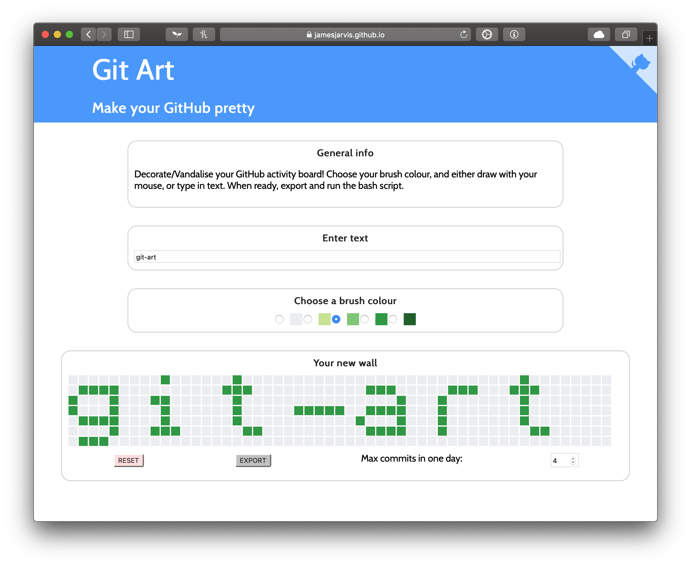
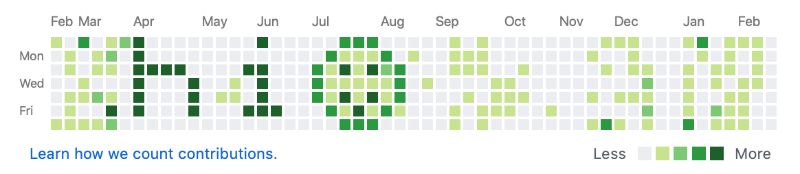

My roommate [Tim](https://www.linkedin.com/in/timothylee0/) and I decided to start challenging ourselves with little applications we could develop.

The first thing we thought of was a way to decorate your GitHub activity board, example below:

The idea being that you could just draw or type (or both) anything that you wanted to on a canvas that represented your github activity board, and with one simple script you could create the required commits and upload that new repo to your GitHub.

We used React for the front end, and wrote simple JavaScript functions to generate the bash script which is available for you to download and run.

Made open source under the [WTFPL licence](http://www.wtfpl.net).