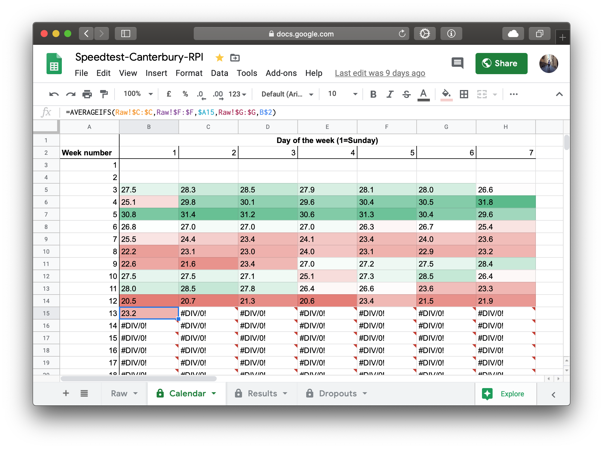

<iframe width="560" height="450" seamless frameborder="0" scrolling="yes" src="https://docs.google.com/spreadsheets/d/e/2PACX-1vQ3g5Eej1JB5I7-o8skZ2sbiAqdNuEeRRvS4AjKsIfhiP1sUhtUjcrHOqrGUalwqNQLCq8QetaNe035/pubchart?oid=1937794798&amp;format=interactive"></iframe>

A quick monitoring project.

As anyone from the UK will know, our internet speeds [aren't quite up to par with the rest of the developed world](https://www.speedtest.net/global-index).

Whilst at university, my internet was being provided by BT, and the fastest we could supposedly get was 35mb download speeds.
However, we were having constant dropouts and nothing was being done about it.
So, I though I would try to monitor the internet a bit closer, I had a spare RPI hanging around not really doing much besides a minecraft server, and thought it would be an interesting experiment.

So, I set up an [IFTTT](https://ifttt.com/) webhook, and a cronjob on the RPI to automatically update a Google Sheets document with the latest speedtest results.

Inspiration thanks to [this project](https://makezine.com/projects/send-ticket-isp-when-your-internet-drops/), and I've had a lot of fun experimenting with the data retrieved.

As it turns out, we have NEVER achieved our advertised internet speed, and dropped out a number of times in the few months I have run this (although as it only runs every half hour, I'm pretty sure we have dropped out more frequently than this).

Other interesting insights from this data include seeing how the [Coronavirus internet surge](https://www.bbc.co.uk/news/technology-51947447) did in fact slow down our internet as everyone moved to remote work.
